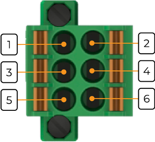

# Модуль основной IPCSA-OG-GM[^1]

## Общие сведения
 
Модуль основной GM (арт. IPCSA-OG-GM) является центральным компонентом системы управления.

{ width="150" }

### Модуль основной выполняет следующие ключевые функции:
* выполнение программы управления;
* опрос модулей расширения;
* подключение сторонних модулей и датчиков по Ethernet;
* обеспечение питания модулей расширения.

## Технические характеристики 
| Характеристика | Значение |
| - | - |
| Максимальная потребляемая мощность, Вт |	7,5
| Номинальное напряжение питания, | В	24
| Диапазон напряжения питания, | В	от 20 до 28
| Резервирование питания 	| Поддерживается
| Индикация при перенапряжении/ недостаточном напряжении |	Да
| Защита при перегрузке по току |	Да
| Максимальное число модулей расширения |	63
| Поддерживаемые интерфейсы |	Ethernet 1000 Мбит/с – 1 (на лицевой части) Ethernet 100 Мбит/с – 2 (на нижней части) microSD – 1 |
| Ядро |	Cortex A55 |
| Оперативная память, Гб |	4, DDR4 |
| Объем памяти, Гб |	32 |
| Питание модулей расширения, Вт |	до 40 (см. Организации питания модулей) |
| Гальваническая изоляция | Между входной и выходной логикой |
| Тип проводника | Медный |
| Сечение проводника, мм2 | От 0,5 до 1,5 |
| Масса, г |	200 |
|Габариты ВхШхГ, мм |	126х30х135 |

## Технические характеристики 
| Характеристика	| Значение |
| - | - |
| Температура эксплуатации, °С |	От минус 40 до 60 |
| Температура хранения, °С |	От минус 40 до 60 |
| Влажность при хранении, %	| От 5 до 95 |
| Влажность при эксплуатации, % |	От 5 до 95 |
| Тип монтажа |	На DIN-рейку 35 мм |
| Расположение при монтаже | Вертикальное |

## Схема подключения
{ width="250" }
## Контакты разъема питания

{ width="180" }

| Обозначение | Наименование канала | Описание |
| ----------- | - | --|
| 1 | +24В_1 | Подключение внеш-него питания 1 |
| 2 | +24В_2 | Подключение внеш-него питания 2 | 
| 3 | GND | Общий контакт | 
| 4 | GND | Общий контакт|
| 5 | FG | Защитное заземление |
| 6 | FG | Защитное заземление |

???+ warning "Предупреждение"

    Без подключения защитного заземления не использовать

## Индикация
{ width="50" }

| Обозначение | Индикация        | Показатель                      |
|------------------|----------------------|---------------------------------------|
| P           | Горит зеленым       | Наличие напряжения питания           |
|  P                   | Не горит           | Отсутствие напряжения питания        |
| L           | Горит зеленым       | Наличие соединения Ethernet          |
|  L                | Мигает желтым      | Обмен данными по Ethernet            |
|  L                | Не горит           | Отсутствие соединения Ethernet       |
| S         | Горит зеленым       | Внутреннее питание в нормальном режиме |
|  S               | Горит красным      | Внутреннее питание в аварийном режиме |
|   S               | Не горит           | Питание отсутствует                  |
| R           | Горит зеленым       | Тумблер режима работы в положении «RUN» |
|  R                | Горит красным      | Тумблер режима работы в положении «STOP» |
| In1         | Горит зеленым       | Наличие внешнего питания 1           |
|    In1              | Не горит           | Отсутствие внешнего питания 1        |
| In2         | Горит зеленым       | Наличие внешнего питания 2           |
|    In2              | Не горит           | Отсутствие внешнего питания 2        |

[^1]: На текущий момент модуль на стадии разработки
