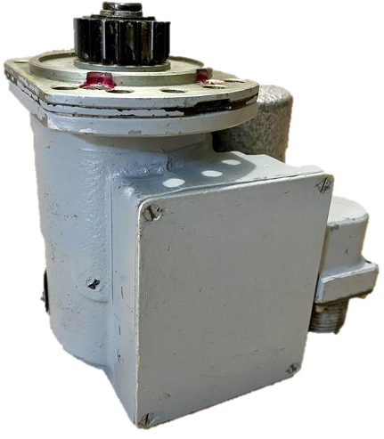
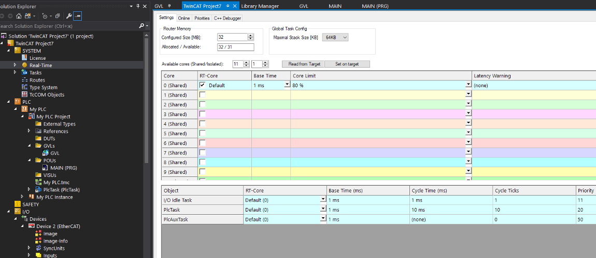

---
date:
    created: 2025-04-17
authors:
  - diachkov
tags:
 - Программное обеспечение

---

# Modbus TCP EtherCAR шлюз через TwinCAT


???+ info "Примечание"
    Статья предназначена для начинающих инженеров-программистов ПЛК в сфере АСУТП, а также для опытных программистов ПЛК, которые впервые планируют работать с данными модулями


На момент написания статьи основной модуль «IPCSA-OG-GM» находится на этапе разработки, однако пользователю может быть интересно начать работу с модулями, поэтому рассмотрим пример, в котором будут использоваться следующие устройства:

 * Персональный компьютер на ОС Windows
 * [Модуль «IPCSA-OG-DI»](../../../user_manual/DI.md) 
 * [Модуль «IPCSA-OG-DO»](../../../user_manual/DO.md) 
 * [Модуль «IPCSA-OG-AIC»](../../../user_manual/AIC.md) 
 
[Модуль «IPCSA-OG-DI»](../../../user_manual/DI.md)  - модуль дискретного ввода (“D” – discrete, “I” – input). Он предназначен для получения дискретных сигналов программой, написанной человеком и исполняющейся непосредственно на главном модуле ПЛК или в некоторых случаях на персональном компьютере. Примерами дискретных сигналов могут быть: обратная связь от концевых выключателей, нажатие кнопки, срабатывание реле и многое другое (на самом деле – любой сигнал определенного напряжения, который имеет только состояния: есть или нет). В данном примере такими сигналами будут обратные связи от клапанов, которые будут давать информацию об одном из своих 2-х положений: «ОТКРЫТ» или «ЗАКРЫТ». Если клапан «ОТКРЫТ», то обратная связь будет постоянно давать +24 В, а если клапан «ЗАКРЫТ», то обратная связь будет давать 0 В. Таким образом, чтобы получать информацию о текущем положении клапанов, потребуется использовать модуль дискретного ввода и подключенные к его каналам (которых 16 шт.) обратные связи клапанов. Также модуль будет использован для получения сигнала от концевых выключателей, входящих в состав привода «УР-10».

[Модуль «IPCSA-OG-DO»](../../../user_manual/DO.md) - модуль дискретного вывода (“D” – discrete, “O” – output). Он предназначен для «отправки» дискретных сигналов программой, написанной человеком и исполняющейся непосредственно на главном модуле ПЛК или в некоторых случаях на персональном компьютере. Примерами, при которых используется отправка дискретных сигналов могут быть: включение индикатора, переключение реле, команда на вращение ДПТ и многое другое. В данном примере отправка дискретных сигналов потребуется для управления вращением привода «УР-10», а также для изменения положения тех самых клапанов. То есть: «отправляя» дискретный сигнал на конкретный клапан, мы фактически заставляем его сменить свое положение. По умолчанию (без подачи дискретного сигнала) все клапаны находятся в положении «ЗАКРЫТ», но если «отправить» дискретный сигнал на какой-либо клапан (подать напряжение = +24 В), то он перейдет в положение «ОТКРЫТ» и будет в нем до тех пор, пока не прекратится отправка дискретного сигнала. Данный модуль так же имеет 16 каналов (это значит, что с его помощью можно независимо друг от друга отправлять 16 дискретных сигналов).

[Модуль «IPCSA-OG-AIC»](../../../user_manual/AIC.md)  - модуль аналогового ввода тока (“A” – analog, “I” – input, “C” - current). Он предназначен для определения уровня аналогового сигнала. Примером аналоговых сигналов могут быть: обратная связь от датчика температуры, датчика давления и многие другие. В нашем примере в качестве такого аналогового сигнала будет использован сигнал от датчика давления «МИДА-ДИ-13П» (Рис. 1). Это аналоговый датчик, измеряющий давление в диапазоне от 0 до 1 Мпа, и в зависимости от давления выдающий в качестве сигнала ток в диапазоне от 4 до 20 мА. Соответственно, если давление, измеренное данным датчиком, составляет 0 Мпа, то он будет выдавать 4 мА (именно 4 мА, а не 0 мА. Это сделано для того, чтобы определять наличие связи с датчиком. Поскольку в таком случае сигнал равный 0 мА означал бы обрыв связи с датчиком, а не нулевое значение давления). 

<figure markdown="span">
  { width="400" }
  <figcaption>Внешний вид датчика давления "МИДА-ДИ-13П"</figcaption>
</figure>

<figure markdown="span">
  { width="200" }
  <figcaption>Внешний вид используемого клапана (катушки соленоида)</figcaption>
</figure>

<figure markdown="span">
  { width="300" }
  <figcaption>Внешний вид привода "УР-10"</figcaption>
</figure>

В качестве «мозгов» системы будем использовать ПО «TwinCAT V3». Данное ПО позволяет разрабатывать код, производить его наладку, выступать в качестве «мозгов» ПЛК, выполняя код, собственными силами.  

Для начала потребуется установить TwinCAT V3. Сделать это можно с помощью [официального сайта разработчика](https://www.beckhoff.com/en-en/support/download-finder/search-result/?c-1=26782567). Для скачивания потребуется пройти регистрацию, которая потребуется и какое-то время спустя для загрузки специального пакета, обеспечивающего работу по Modbus TCP.  

Далее выполняем процедуру, описанную в  данной [статье](../twincat_connect/twincat_connect.md). Однако, преодолев всю последовательность действий из приведенной статьи, мы столкнемся с проблемой – подключаемые модули отобразятся в нашем проекте некорректно и у нас не будет возможности адекватно их использовать. Это связано с тем, что пол умолчанию TwinCAT не знаком с данными модулями, и чтобы их подружить, требуется добавить <a href="/downloads/IPCSA_OG.xml" download>XML конфигурационный файл для TwinCAT</a>  . После скачивания конфигурационного файла в формате «xml», его нужно переместить в следующую директорию: C:\TwinCAT\3.1\Config\Io\EtherCAT. Далее нужно перезагрузить TwinCAT и повторить заново всю последовательность действий из [статьи](../twincat_connect/twincat_connect.md). Теперь все должно быть хорошо и в дереве проекта найденные модули отобразятся так же, как и в статье. Если модули не находятся, то может возникнуть следующая ошибка:
<figure markdown="span">

</figure>
Попробуйте перезагрузить ПК и снова попробовать просканировать модули. Если ошибка появляется снова, то напишите автору статьи и мы постараемся осветить решение возникшей проблемы в следующей статье.  
Итак, после успешной коммуникации вашего ПК и модулей, дерево проекта будет выглядеть следующим образом:
<figure markdown="span">

</figure>
В данном примере из дерева проекта удалены за отсутствием потребности блоки: «MOTION», «C++», «ANALYTICS». Они могли бы потребоваться для работы с сервоприводами, написанием части кода на языке С++ или для анализа различных процессов.   
В нашем примере мы напишем простой код. Для этого нажимаем правой кнопкой мыши по блоку «PLC» и выбираем «Add new item…», после чего появляется окно:
<figure markdown="span">

</figure>
Выбираем «Standard PLC Project» (можем ввести название в поле «Name» или оставить по умолчанию) и нажимаем «Add».   
После добавления стандартного ПЛК проекта в дереве переходим в блок «POUs» и открываем файл «MAIN (PRG)». Это основной исполняемый файл, в котором будет наш будущий код:
<figure markdown="span">

</figure>
Если Вам довелось поработать в CODESYS, то окно будет вам немного знакомо. Оно делится на две части:  

1. Верхняя – предназначена для объявления и инициализации переменных:  
2. Нижняя – предназначена для написания логики (кода).  

Начнем с переменных. Как уже было отмечено раннее, в данном примере есть аналоговые датчики давления (4 шт.), клапаны (6 шт.) и привод (1 шт.). 
<figure markdown="span">

</figure>

Сперва объявим переменные для датчиков давления. На рисунке выше – у меня уже объявлены все переменные, поэтому не пугаемся, а начинаем пошагово:
Pressure_sensor_1_ORANGE_AI1 : REAL; // Сначала идет название переменной («Pressure_sensor_1_ORANGE_AI1»), затем через символ «:» указывается тип переменной (в нашем случае это тип данных «REAL», поскольку аналоговый сигнал от датчика давления преобразуется в модуле «IPCSA-OG-AIC» с помощью аналого-цифрового преобразователя в цифровое вещественное значение, соответствующее уровню текущего аналогового сигнала), в конце строки ставится символ «;». 
???+ note "Примечание"
    Название переменной включает слово «ORANGE», потому что провода, которые я подключал к данному датчику имеют оранжевый цвет. :slight_smile:

Далее по такому же принципу объявляем еще 3 переменных для оставшихся 3-х датчиков: «Pressure_sensor_2_BLUE_AI2», «Pressure_sensor_3_GREEN_AI3», «Pressure_sensor_4_BROWN_AI4».  

Пока что в данные переменные ничего не записывается, потому что они никак не связаны с датчиками, кроме как названием, поэтому чуть позже привяжем их к датчикам.  

Теперь перейдем к клапанам. Эти товарищи управляются с помощью дискретных сигналов, поэтому для них будем использовать тип данных «BYTE» (почему именно BYTE, а не BOOL – расскажу дальше). Сперва нужно понять следующее: для управления клапанами мы будем использовать модуль [«IPCSA-OG-DO» (дискретный вывод)](../../../user_manual/DO.md) . Если Вы еще не изучали структуру просканированных Твинкатом модулей, то сейчас самое время:
<figure markdown="span">

</figure>
Модуль имеет 16 каналов, и, с точки зрения программной архитектуры, разделен на 2 байта: «Byte 0» и «Byte 0_1». Как мы с Вами знаем – каждый байт состоит из 8 бит, откуда и получаем, что 2 байта = 16 битам, то есть количеству каналов данного модуля (у модуля «IPCSA-OG-DI» все схоже). Таким образом каждый бит – это значение сигнала определенного канала модуля. Иными словами: если какой-то бит имеет в какой-то момент времени значение 0 (FALSE), то сигнал на соответствующем канале отсутствует (не подается напряжение), а если значение 1 (TRUE), то напряжение/сигнал на соответствующем канале есть. Чтобы управлять соленоидами (открывать или закрывать их), нам нужно управлять этими самыми битами, меняя их значения, в соответствии с тем, чего мы хотим от клапана. Возникает вопрос: «если мы управляем битами, то почему мы должны добавить переменную типа BYTE?» - потому что таким образом мы сможем легко привязать переменную к группе бит: к байту «Byte 0» и «Byte 0_1». Автор допускает, что это можно сделать различными путями, однако, в силу того, что автор – Я, то я могу использовать тот способ, который мне показался наиболее удобным. Я, как и Вы, постоянно учусь, а этот проект один из первых в данной программе. Если в будущем я найду более подходящий вариант – обязательно покажу его Вам. Итак, объявим переменную, которая будет состоять из 16 бит:

outputBytes AT %Q* : ARRAY[1..2] OF BYTE; // « outputBytes» - название переменной; «AT %Q*» - специальный «идентификатор», говорящий Твинкату о том, что данная переменная должна быть связана с областью, отвечающей за выходы; «ARRAY[1..2] OF BYTE» - массив из двух байт (то есть 16 бит).  

Такую же историю повторяем для дискретных входов (модуля «IPCSA-OG-DI»):  

inputBytes AT %I* : ARRAY[1..2] OF BYTE; // « inputBytes» - название переменной; «AT %I*» - специальный «идентификатор», говорящий Твинкату о том, что данная переменная должна быть связана с областью, отвечающей за входы; «ARRAY[1..2] OF BYTE» - массив из двух байт (то есть 16 бит).
  
Ну и наконец-то – аналоговый сигнал:  

analogIN AT %I* : ARRAY[1..4] OF REAL;  // « analogIN» - название переменной; «AT %I*» - специальный «идентификатор», говорящий Твинкату о том, что данная переменная должна быть связана с областью, отвечающей за входы; «ARRAY[1..4] OF REAL» - массив из 4 вещественных чисел. 

В конечном итоге у нас должно получиться так:
 
``` pascal
PROGRAM MAIN
VAR
  Pressure_sensor_1_ORANGE_AI1 : REAL;
  Pressure_sensor_2_BLUE_AI2 : REAL;
  Pressure_sensor_3_GREEN_AI3 : REAL;
  Pressure_sensor_4_BROWN_AI4 : REAL;
  outputBytes AT %Q* : ARRAY[1..2] OF BYTE;
  inputBytes AT %I* : ARRAY [1..2] OF BYTE;
  analogIN AT %I* : ARRAY[1..4] OF REAL;
END_VAR
```
На данном этапе мы объявили переменные, некоторым из которых присвоили идентификаторы, чтобы TwinCAT понимал, как нужно их использовать. Теперь присвоим непосредственно сигналы, которые получают или отправляют модули с переменными. Для этого нужно перейти к конкретному модулю в дереве проекта:

<figure markdown="span">

</figure>

Начнем с [модуля «IPCSA-OG-DO»](../../../user_manual/DO.md). Раскрываем его структуру и нажимаем на в первом байте «Byte 0» на вкладку «Output» (она содержит 8 битов = 8 каналов). Справа откроется окно, в котором на вкладке «Variable» нужно нажать на кнопку «Linked to…»:

<figure markdown="span">

</figure>

В открывшемся окошке отобразятся переменные доступные для присвоения. Поскольку мы объявили массив «outputBytes» для области выхода (с помощью идентификатора «AT %Q*») и поскольку Твинкат благодаря конфигурационному файлу знает, что выбранный модуль отвечает за выход, то для присвоения он предлагает тот самый массив. Выбираем из списка любой из двух байтов массива, пусть это будет нулевой «outputBytes[1]» и нажимаем «ОК». Теперь 8 каналов модуля «IPCSA-OG-DO» присвоены 8 битам из нулевого байта массива «outputBytes». То же самое нужно сделать для оставшихся 8 каналов:  

Из дерева проекта нажимаем на второй байт «Byte 0_1» на вкладку «Output» (она содержит 8 битов = 8 каналов). Справа откроется окно, в котором на вкладке «Variable» нужно нажать на кнопку «Linked to…» и проделываем то же самое, выбирая из списка «outputBytes[2]».   

Повторяем процедуру для модуля «IPCSA-OG-DI» - действия идентичны, только на этот раз Твинкат предложит массив «inputBytes», потому что его размерность и тип данных соответствуют структуре, которой мы его присваиваем.  

Для аналогового модуля процедура также схожа, но там вместо массивов будет четыре переменные типа REAL:
<figure markdown="span">

</figure>

Поздравляю, теперь все переменные «дружат» с каналами модулей. Следующий этап – добавление Modbus TCP и написание кода.  

Для добавления Modbus TCP в наш проект потребуется установить пакет с оф. [Сайта BECKHOFF](https://www.beckhoff.com/en-en/support/download-finder/search-result/?download_group=97173730&download_item=97173916)). Как говорилось ранее, чтобы скачать – потребуется регистрация. После установки скаченного файла, перезагрузим Твинкат и вернемся к нашему коду и перейдем на вкладку «GVLs» и откроем блок «GVL»:

<figure markdown="span">

</figure>

У вас он будет по умолчанию пустой. Чтобы добавить Modbus TCP, нужно самостоятельно объявить переменные для регистров ровно так, как будет показано дальше (это стандартный набор переменных, чтобы добавить регистры):

``` pascal
VAR_GLOBAL
  mb_Input_Coils : ARRAY [0..255] OF BOOL;
  mb_Output_Coils : ARRAY [0..255] OF BOOL;
  mb_Input_Registers : ARRAY [0..255] OF WORD;
  mb_Output_Registers : ARRAY [0..255] OF WORD;
END_VAR
```
Объявляем переменные, как показано на рисунке выше. Массив «mb_Output_Registers» - это и есть Holding Registers. Именно с его помощью и будет реализован обмен информацией. Итак, после объявления переменных про блок «GVL» можно временно забыть и вернуться к «MAIN (PRG)».   

  Логика работы программы будет следующая: сторонний ПК с помощью Modbus TCP будет менять значения в массиве «mb_Output_Registers», эти изменения будут приводить к включению/отключению различных устройств (клапанов и привода). Кроме такого управления, сторонний ПК будет не только изменять значения в массиве, но и считывать текущие значения, чтобы получать какую-то информацию от нашей системы. Итак, клапаны и привод включаются или отключаются в зависимости от значения, записанного в массиве «mb_Output_Registers», в то же время, в этот массив будет записываться информация о текущих положениях клапанов и концевых выключателей привода, а также показания датчиков давления.  

  Начнем с управления. Так сложилось, что у меня первые опытные образцы модулей, поэтому на них еще перепутаны местами каналы и биты, за них отвечающие. То есть, по логике, у нас есть 2 байта = 16 бит = 16 каналам и хочется верить, что первый бит – это первый канал, второй бит – это второй канал и т.д. Однако в моем случае они такой логики не имеют, и за первый канал может отвечать, например 5-ый бит. Поэтому мне понадобилось опытным путем определить какие биты, за что отвечают (поэтому не пугаемся, что у меня биты написаны в случайном порядке). Итак:

<figure markdown="span">

</figure>

Код состоит из условий – если значение конкретного бита в регистре равно нулю (FALSE), то клапан находится в положении «ЗАКРЫТ» (не подается напряжение), а если значение равно 1 (TRUE), то клапан переходит в положение «ОТКРЫТ» (подается напряжение):

``` pascal
IF GVL.mb_Output_Registers[0].0 = 0 THEN // Соленоид "Накал давления"
  outputBytes[1].7 := 0;
ELSE
  outputBytes[1].7 := 1;
END_IF

```
// GVL.mb_Output_Registers[0].0 – это обращение к блоку «GVL», в котором мы добавили регистры в виде массива «mb_Output_Registers». Каждый регистр занимает 2 байта, что равно типу данных «WORD». Таким образом массив «mb_Output_Registers» содержит 256 регистров, каждый из которых по 16 бит. Поэтому запись «GVL.mb_Output_Registers[0].0» означает обращение к нулевому биту «.0» нулевого байта «[0]». Так вот, если значение этого бита равно нулю (FALSE), то «outputBytes[1].7 := 0;». Как мы помним, массив «outputBytes» состоит из двух байтов и связан с каналами модуля «IPCSA-OG-DO». Тогда запись «outputBytes[1].7 := 0;» означает, что конкретный канал этого модуля будет отключен, а запись «outputBytes[1].7 := 1;» означает, что канал будет включен (будет напряжение) и клапан откроется. Таким образом подряд прописываем условия для всех клапанов (меняться будет только обращение к другому биту в регистре и канал, который связан с массивом «outputBytes». Ниже приведен мой код (его можно написать куда более красиво, однако в ознакомительных целях – это самое то):
``` pascal
IF GVL.mb_Output_Registers[0].0 = 0 THEN // Соленоид "Накал давления"
  outputBytes[1].7 := 0;
ELSE
  outputBytes[1].7 := 1;
END_IF

IF GVL.mb_Output_Registers[0].1 = 0 THEN // Соленоид "Сброс давления"
  outputBytes[2].0 := 0;
ELSE
  outputBytes[2].0 := 1;
END_IF

IF GVL.mb_Output_Registers[0].2 = 0 THEN // Соленоид №1
  outputBytes[2].4 := 0;
ELSE
  outputBytes[2].4 := 1;
END_IF

IF GVL.mb_Output_Registers[0].3 = 0 THEN // Соленоид №2
  outputBytes[2].3 := 0;
ELSE
  outputBytes[2].3 := 1;
END_IF

IF GVL.mb_Output_Registers[0].4 = 0 THEN // Соленоид №3
  outputBytes[2].2 := 0;
ELSE
  outputBytes[2].2 := 1;
END_IF

IF GVL.mb_Output_Registers[0].5 = 0 THEN // Соленоид №4
  outputBytes[2].1 := 0;
ELSE
  outputBytes[2].1 := 1;
END_IF

```

Теперь перейдем к приводу. У него есть два направления вращения и два концевых выключателя, которые срабатывают в момент, когда привод физически поворачивается на определенный угол в определенном направлении (условно так: представим, что вал привода находится в каком-то своем среднем положении между двумя концевыми выключателями. Тогда, если он будет вращаться по часовой стрелке и достигнет угла поворота в 150 градусов, то нажмется концевой выключатель и привод физически остановится. После чего можно будет вращать его уже против часовой стрелки, и когда он начнет вращаться против часовой стрелки, то нажатый концевой выключатель «отожмется». Как только вал привода повернется сначала до среднего положения обратно, а потом пройдет еще 150 градусов, то нажмется второй концевой выключатель). Дискретный сигнал от концевого выключателя по проводу приходит на один из каналов модуля «IPCSA-OG-DI». Наличие или отсутствие этого сигнала (как и остальных дискретных) можно наблюдать с помощью массива «inputBytes». Давайте напишем такой вот кусочек кода для привода:

``` pascal
IF GVL.mb_Output_Registers[0].6 = 0 THEN // УР "открыть"
  outputBytes[1].6 := 1;
  outputBytes[1].5 := 0;
ELSE
  outputBytes[1].5 := 1;
  outputBytes[1].6 := 0;
END_IF
```
В этом коде буквально написано следующее: если значение шестого бита в нулевом регистре равно нулю (FALSE) (GVL.mb_Output_Registers[0].6 = 0), то будет напряжение на канале, отвечающим за вращение по часовой стрелке (outputBytes[1].6 := 1), и вал привода будет вращаться в эту сторону, в то время как канал, отвечающий за дискретный сигнал для вращения против часовой стрелки будет отключен (outputBytes[1].5 := 0). А если значения шестого бита в регистре будет равно 1 (TRUE), то будет наоборот. С управлением закончено. Теперь можно перейти к получению информацию.  
Как говорилось ранее, кроме управления сторонний ПК будет получать информацию о текущем положении клапанов, концевых выключателей и показания датчиков давления. Здесь все просто, потому что код будет, можно сказать зеркальным. Смотрим:
``` pascal
IF inputBytes[1].7 = 0 THEN // Соленоид "Накал давления" Обратная связь
  GVL.mb_Output_Registers[1].0 := 0;
ELSE
  GVL.mb_Output_Registers[1].0 := 1;	
END_IF

```

Как Вы можете видеть, здесь в условии уже проверяется наличие или отсутствие сигнала на каналах модуля «IPCSA-OG-DI», поскольку массив «inputBytes» связан с каналами этого модуля. В приведенном кусочке кода проверяется значение седьмого бита в первом байте массива «inputBytes» и если он равен 0 (FALSE), то нулевой бит в первом регистре равен 0, а если значение седьмого бита в первом байте массива «inputBytes» равно 1 (TRUE), то нулевой бит в первом регистре равен 1. Таким образом сторонний ПК по значению соответствующего бита в регистре сможет понять – открыт клапан или закрыт. Такая же история и с концевыми выключателями, поэтому не буду приводить код для них и для оставшихся клапанов (в конце статьи будет ссылка на проект, где Вы сможете все это посмотреть самостоятельно). Теперь остается решить вопрос с аналоговыми датчиками давления. Вот код для них:

``` pascal
Pressure_sensor_1_ORANGE_AI1 := (analogIN[1]-4)/16;
MEMCPY(ADR(GVL.mb_Output_Registers[2]),ADR(Pressure_sensor_1_ORANGE_AI1),2);
MEMCPY(ADR(GVL.mb_Output_Registers[3]),ADR(Pressure_sensor_1_ORANGE_AI1)+2,2);

```

В первой строчке переменной «Pressure_sensor_1_ORANGE_AI1» присваивается значение, хранящееся в «analogIN[1]». Как было сказано ранее – «analogIN[1]» это первое вещественное число в массиве «analogIN», которое связано с каналом модуля «IPCSA-OG-AIC». Таким образом: датчик давления измеряет давление, формирует аналоговый сигнал в диапазоне от 4 до 20 мА, который поступает на канал модуля «IPCSA-OG-AIC», где он с помощью аналого-цифрового преобразователя преобразуется в численное значение, которое записывается в привязанную к данному каналу вещественную переменную из массива «analogIN». В ней хранится численное значение показаний датчика в мА ( от 4 до 20 мА). Поскольку мы хотим следить не за мА, а все таки именно за значением давления в МПа, то нам нужно привести значение в мА к значению в МПа. Для этого используется стандартная линейная формула. Говоря человеческими словами – нужно сделать так, чтобы значение в 4 мА было бы равно 0 МПа, а 20 мА равнялись бы 1 МПа. Для этого используется формула нормализации:

$$
\ value(МПа)=\frac{x(мА) + x_{\text{min}}(мА)}{x_{\text{max}}(мА) + x_{\text{min}}(мА)}
$$

где:  

* value(МПа) – искомое значение давления в МПа;  
* x(мА) – показания датчика, хранящиеся в вещественной переменной массива «analogIN»;  
* x_min (мА) – минимальное значение измеряемого диапазона (в нашем случае 4 мА);  
* x_max (мА) – максимальное значение измеряемого диапазона (в нашем случае 20 мА);  

Поэтому в приведенном кусочке кода в переменную «Pressure_sensor_1_ORANGE_AI1» записывается уже нормализованное значение. А дальше идут две строчки кода, которые у неподготовленного зрителя могут вызывать панику, но не бойтесь. На самом деле здесь все просто. Дело в том, что нам нужно значение давления в МПа передать стороннему ПК с помощью Modbus TCP. Обмен происходит с помощью регистров, которые занимают по 2 байта. И тут в дело вступают особенности обмена. Дело все в том, что регистр можно представить в виде следующей записи: «AB», где «A» - первый байт, а «B» - второй байт. Так вот, переменная «Pressure_sensor_1_ORANGE_AI1» имеет тип данных REAL, которая занимает 4 байта, поэтому, чтобы передать такое значение по Modbus, нам потребуется не один регистр, а целых два. В приведенном примере – это регистр «GVL.mb_Output_Registers[2]» и «GVL.mb_Output_Registers[3]». Поэтому нам нужно «разделить» четырехбайтовую переменную «Pressure_sensor_1_ORANGE_AI1» на две части, каждая из которых будет занимать по два байта – то есть разделим ее на «AB» и «CD», где «AB» - первые два байта, а «CD» - последние два байта. Сделать это можно с помощью функции «MEMCPY»:
MEMCPY(ADR(GVL.mb_Output_Registers[2]),ADR(Pressure_sensor_1_ORANGE_AI1),2); // в этой строке мы берем целевое расположение (куда нужно записать) «GVL.mb_Output_Registers[2]» и источник (откуда нужно взять информацию для записи) «Pressure_sensor_1_ORANGE_AI1», а затем указываем сколько информации в байтах нужно взять из источника (2). Таким образом в регистр «GVL.mb_Output_Registers[2]» запишутся первые два байта «AB» переменной «Pressure_sensor_1_ORANGE_AI1». Теперь нужно «запихнуть» оставшиеся два байта «CD» переменной «Pressure_sensor_1_ORANGE_AI1». Для этого рассмотрим следующую строчку кода:
MEMCPY(ADR(GVL.mb_Output_Registers[3]),ADR(Pressure_sensor_1_ORANGE_AI1)+2,2); // в этой строке мы берем целевое расположение (куда нужно записать) «GVL.mb_Output_Registers[3]» и источник (откуда нужно взять информацию для записи) «Pressure_sensor_1_ORANGE_AI1», а затем указываем сколько информации в байтах нужно взять из источника (2). Но здесь появляется запись «+2», а появляется она потому что в источнике после переноса ничего не поменялось – там все еще 4 байта «AB» и «CD», поэтому нужно взять не первые два байта, а следующие за ними. Для этого нам нужно «сместить» место, откуда мы копируем данные и подвинуть «условный курсор» на два байта вправо. Вот почему тут добавляется запись «+2». Таким образом в регистр «GVL.mb_Output_Registers[2]» запишутся первые два байта «AB» переменной «Pressure_sensor_1_ORANGE_AI1». Ну вот и все. Теперь значение давления в МПа от датчика записано в регистры «GVL.mb_Output_Registers[2]» и «GVL.mb_Output_Registers[3]» и готово к обмену по Modbus TCP.  

Осталось самое интересное запустить и проверить работу, однако до этого момента нужно провести некоторые подготовления. Для корректной работы TwinCAT в качестве «мозгов» ему требуется выделить ядро вашего драгоценного процессора. Для этого в дереве проекта переходим во вкладку «SYSTEM» в дереве проекта и открываем «Real-Time». У нас откроется следующее окно:

<figure markdown="span">

</figure>

Затем нужно нажать на кнопку «Read from Target», после чего всеми цветами радуги в списке отобразятся доступные ядра процессора. Одно из них нам нужно сделать изолированным. Для этого рядом с надписью «Available cores (Shared/Isolated)» нужно изменить соотношение (на единицу уменьшить левое значение, а правое наоборот на единицу увеличить:

<figure markdown="span">

</figure>

После чего в списке появится одно ядро с подписью «Isolated»:

<figure markdown="span">

</figure>
Ставим возле него галочку, а с других ядер снимаем и нажимаем на кнопку «Set on target». После этой процедуры нужно сохранить проект и перезагрузить ваш ПК. Теперь мы готовы к запуску.
  Вновь открываем наш проект и нажимаем на кнопку :octicons-gear-16: в верхнем левом углу.
<figure markdown="span">

</figure>

В появившемся окне соглашаемся и нажимаем «ОК». 

В моем случае (из-за того, что модули находятся на стадии разработки) не все еще налажено, поэтому иногда может возникать такая ошибка:
<figure markdown="span">

</figure>
Для исправления данной ошибки нужно:
figure markdown="span">

</figure>
В дереве проекта нажимаем на соотвествующий box, в открывшемся справа окне переходи на вкладку «EtherCAT» и нажать кнопку «Advanced Settings...». В открывшемся окне перейти на вкладку «General», а в ней нажимаем на «FMMU / SM»:
<figure markdown="span">

</figure>
Справа откроется окно как показано на рисунке выше. В нем нужно выбрать строчку, как показано на рисунке ниже и затем нажать кнопку «Edit…».   
В открывшемся окне нужно сменить «Buffer» с «3» на «1» и нажать «ОК».  

После чего повторить попытку запуска системы с помощью кнопки :octicons-gear-16:. Если все хорошо, то система перейдет в режим «Free Run», затем нужно в верхней части экрана найти кнопку (1) и нажать на нее, после чего Твинкату потребуется немного времени. Как только он справится со своими процессами, то кнопка (2) загорится зеленым цветом и ее будет необходимо нажать. После этого наша система полностью готова к работе и сторонний ПК может подключаться по Modbus TCP (в качестве IP-адреса нужно использовать IP-адрес ПК, на котором запущен TwinCAT)
<figure markdown="span">

</figure>
Здесь есть один важный момент! Чтение наших регистров начинается в адреса 32768. Если читать, начиная с адреса меньшего, чем 32768 – это приведет к ошибке. Таким образом, с точки зрения стороннего ПК, в регистре 32768 – биты для управления клапанами и приводом (начиная с младшего бита), в регистре 32769 – биты, информирующие о состоянии положений клапанов и концевых выключателей привода, в регистрах 32770-32771 – значение давления первого аналогового датчика, в регистрах 32772-32773 – значение давления второго аналогового датчика, в регистрах 32774-32775 – значение давления третьего аналогового датчика, в регистрах 32776-32777 – значение давления четвертого аналогового датчика. Информацию про Modbus TCP в TwinCAT можно найти [здесь](https://download.beckhoff.com/download/Document/automation/twincat3/TF6250_TC3_Modbus_TCP_EN.pdf). На этом на сегодня все, спасибо за внимание! Желаю удачи!