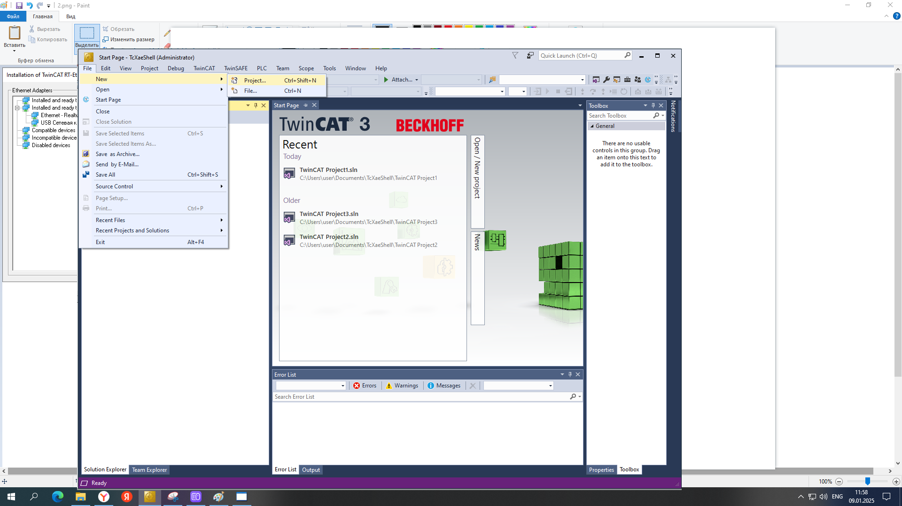
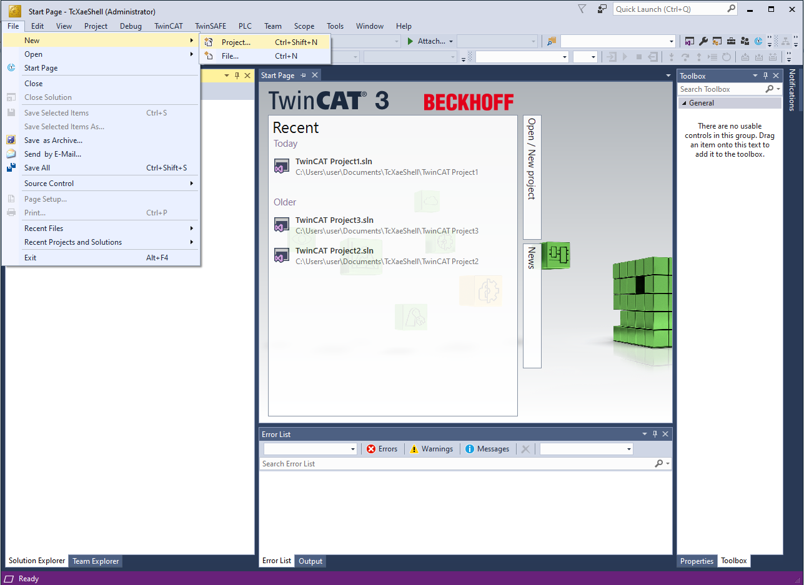
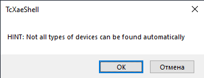
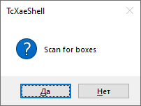
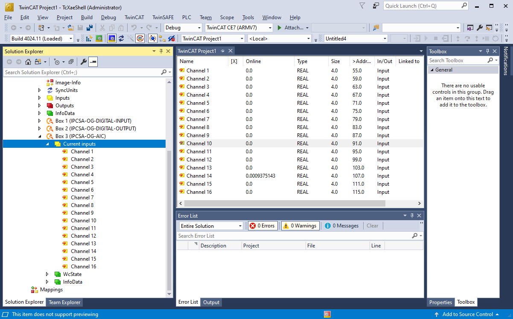
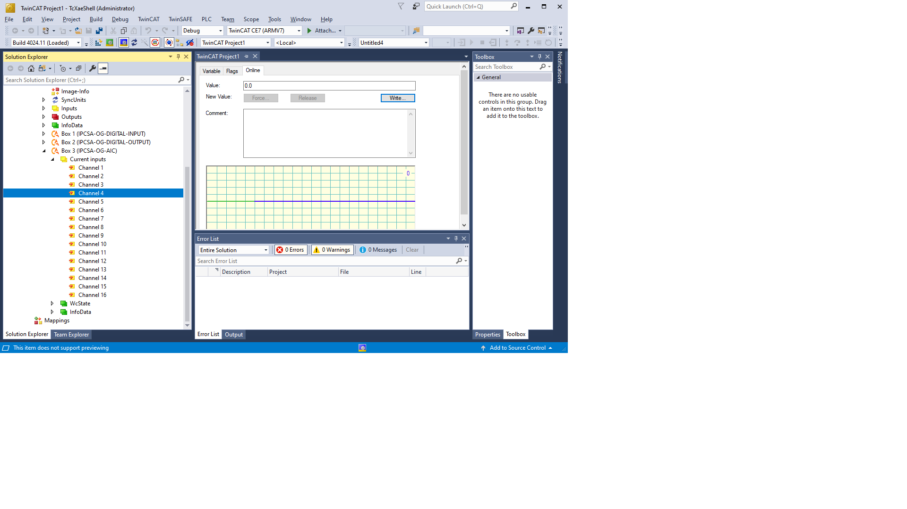

---
date:
    created: 2025-01-14
authors:
  - leonchuk
tags:
 - Программное обеспечение

---

# Подключение модулей расширения без использования основного модуля через TwinCAT
Сегодня я расскажу как подключить модули расширения нашей разработки к TwinCAT.
 
#### В этом примере буду использовать следующие модули:
* [Модуль дискретного ввода IPCSA-OG-DI](../../../user_manual/DI.md) 
* [Модуль дискретного вывода IPCSA-OG-DO](../../../user_manual/DO.md)
* [Модуль аналогового ввода тока IPCSA-OG-AIC](../../../user_manual/AIC.md)
* [Модуль ввода дополнительного питания IPCSA-OG-SPPM](../../../user_manual/SPPM.md)
* [Модуль оконечный IPCSA-OG-SPТM](../../../user_manual/SPTM.md)

???+ info "Заметка"

    В моем примере используется Windows 10 и TwinCAT 3.5
Устанавливаем программу TwinCAT после установки необходимо установить драйвера сетевой карты. Для этого во вскладке "TwinCAT" выбираем "Show Realtime Ethernet Compatible Devies..."  

#### В открывшемся окне есть 5 категорий:
1. Instaled and ready to use devices (realtime capale)
2. Instlaed and ready to use devices (for demo use only)
3. Compatible devices
4. Incompatible devices
5. Disabled devices  

Найдите вашу сетевую карту, если она в 1 или 2 категории, то ничего делать не нужно. Если она в 3 категории - нажмите кнопку "install". Если она в 4 категории - ваша сетевая карта не поддерживается  Если она в 5 категории - нажмите кнопку "Enable"

???+ info "Заметка"

    Если вы запускаете TtwinCAT через виртуальную машину, то вероятно, что сетевая карта не будет поддерживаться. 

Закрываем окно и создаем новый проект
  
В левом меню выбираем "TwinCAT Projects" и нажимаем "Ok"
  
После загрузки нового проекта (процесс не быстрый) в левой части появится дерево устройств. Открываем "I/O" и правой кнопкой нажимаем на Devices. В выпадающем меню нажимаем "Scan"
  
Соглашаемся с предупреждением  
  
В открывшемся меню будут показаны найденые устройства и сетевые карты, через которые они были найдены. Выбираем наше устройство и нажимаем "Ok"    
  
Соглашаемся на сканирование модулей расширения  
  
Включаем онлайн режим  
  
После сканирования в дереве устройств появятся наши модули в порядке их подключения.  

???+ info "Заметка"

    В дереве устройств не будет[ модуля ввода дополнительного питания ](../../../user_manual/SPPM.md) и [оконечного модуля ](../../../user_manual/SPTM.md) так как они являются "пассивными" и не имеют etherCAT
   
Нажмем на  Box 3 

Раскроется меню с сущностями PDO нашего модуля. 

Нажмем правой кнопкой на интересующую сущность и выберем "online read"
Мы получили значение тока измеренного на входе нашего модуля.    
Ура!