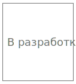

# Модуль аналогового ввода синусно-косинусного трансформатора REMA-P5-AISCT

## Общие сведения

??? example "Разработка"

    На текущий момент модуль на стадии разработки. Серийный выпуск запланирован на 2026 год 

{ width="150" align=left  }
Модуль аналогового ввода синусно-косинусного трансформатора AISCT (арт. REMA-P5-AISCT) является 2-х канальным модулем расширения и предназначен для получения аналоговых сигналов от синусно-косинусных трансформаторов

## Технические характеристики 
| Характеристика                          | Значение                          |
|-----------------------------------------|-----------------------------------|
| Максимальная потребляемая мощность, Вт  | Тестируется                       |
| Количество входных каналов              | 2                                 |
| Гальваническая изоляция                 | Между входной и выходной логикой  |
| Сечение проводника, мм²                 | От 0,2 до 1,5                     |
| Масса, г                                | 125                               |
| Габариты ВхШхГ, мм                      | 126х21,3х90                       |

## Эксплуатационные характеристики
| Характеристика                   | Значение           |
| -------------------------------- | -                  |
| Температура эксплуатации, °С     | От минус 40 до 60  |
| Температура хранения, °С         | От минус 40 до 60  |
| Влажность при хранении, %	       | От 5 до 95         |
| Влажность при эксплуатации, %    | От 5 до 95         |
| Тип монтажа                      | На DIN-рейку 35 мм |
| Расположение при монтаже         | Вертикальное       |

## Схема подключения

{ width="370"; align=left  }

{ width="170";  }

| Обозначение | Наименование канала | Описание          |
|-------------|---------------------|-------------------|
| 1           | SIN1(P)               | Входной канал 1 (+ sin)   |
| 2           | SIN1(N)               | Входной канал 1 (- sin)    |
| 3           | COS1(P)               | Входной канал 1 (+ cos)   |
| 4           | COS1(N)               | Входной канал 1 (- cos)     |
| 5           | EXO1(P)               | Выход генератора частоты возбуждения 1 (+)  |
| 6           | EXO1(N)               | Выход генератора частоты возбуждения 1 (-)     |
| 7           | GND                 | Общий контакт   |
| 8           | GND                 | Общий контакт     |
| 9           | SIN2(P)               | Входной канал 2 (+ sin)   |
| 10          | SIN2(N)               | Входной канал 2 (- sin)     |
| 11          | COS2(P)               | Входной канал 2 (+ cos)   |
| 12          | COS2(N)               | Входной канал 2 (- cos)     |
| 13          | EXO2(P)               | Выход генератора частоты возбуждения 2 (+)   |
| 14          | EXO2(N)               | Выход генератора частоты возбуждения 2 (-)     |
| 15          | GND                 | Общий контакт    |
| 16          | GND                 | Общий контакт     |
| 17          | GND                 | Общий контакт     |
| 18          | GND                 | Общий контакт     |

## Индикация
| Обозначение | Индикация | Показатель |
|------------------|----------------------|---------------------------------------|
| P | :green_circle:| Наличие напряжения питания |
| P | :white_circle:| Отсутствие напряжения питания |
| L | :green_circle:| Наличие соединения Ethernet |
| L | :yellow_circle: :green_circle: :yellow_circle: | Обмен данными по Ethernet |
| L | :white_circle:| Отсутствие соединения Ethernet|

## Размеры

=== "Габаритные размеры" 
    { width="580"  }
=== "Установочные размеры"
     

## 3D-модель
<model-viewer src="https://manual.saplc.ru//img/3d/DI.glb"
alt="3D Model"
auto-rotate
camera-controls
poster="https://manual.saplc.ru//img/3d/posterDI.webp"
camera-orbit="160deg 75deg 348m"
field-of-view="30deg"
exposure="0.5"
style="width: 100%; height: 500px;">
</model-viewer>

## Файлы для скачивания   
<a href="/downloads/Module 18-pin.step" download>3D-модель</a>   
<a href="/downloads/Module 18-pin.dwg" download>2D-модель</a>    