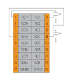
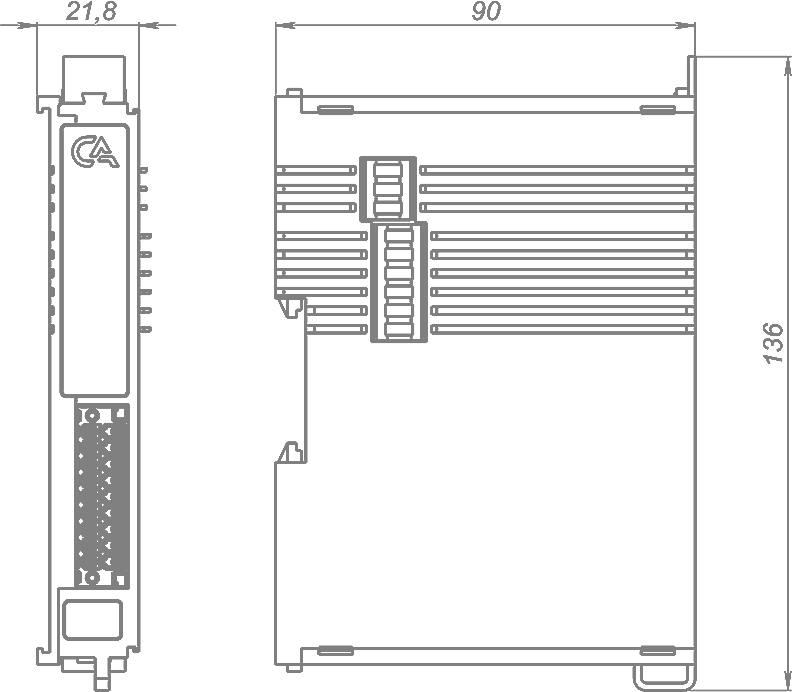
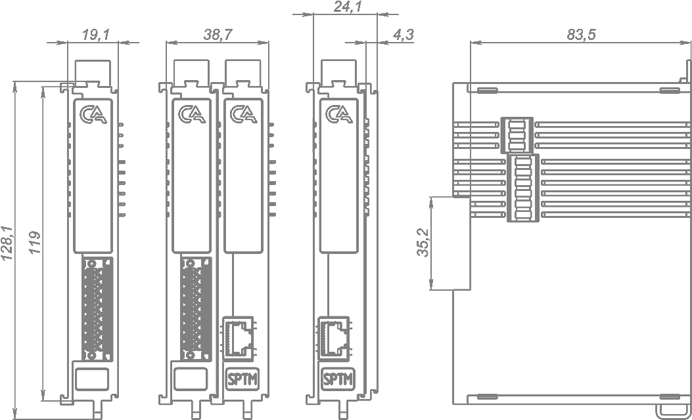

# Модуль аналогового ввода термопары IPCSA-OG-AITC

## Общие сведения

??? note "Разработка"

    На текущий момент модуль на стадии разработки. Начало тестирования запланировано на апрель 2025 года

{ width="150" align=left  }
Модуль аналогового ввода термопары (AITC) (арт. IPCSA-OG-AITC) является 
8-ми канальным модулем расширения  и предназначен для приема сигналов от элементов измерения температуры.  
Модуль имеет 7 каналов измерения температуры от термопар и 1 канал измерения температуры холодного спая.

## Технические характеристики 

| Характеристика                                       | Значение                          |
|------------------------------------------------------|-----------------------------------|
| Максимальная потребляемая мощность, Вт              | 5,5                               |
| Количество входных каналов термопар                 | 7                                 |
| Количество входных каналов измерения температуры холодного спая | 1                                 |
| Типы термопар                                        | См. таблицу 2                     |
| Компенсация температуры холодного спая              | Внутренняя, Внешняя               |
| Тип термосопротивлений холодного спая               | Pt100 климатического исполнения   |
| Время преобразования на все каналы, мс              | Не более 50                       |
| Погрешность модуля                                   | См. таблицу 2                     |
| Разрядность АЦП, бит                                 | 24                                |
| Гальваническая изоляция                              | Между входной и выходной логикой  |
| Тип проводника                                       | Медный                            |
| Сечение проводника, мм²                              | От 0,2 до 1,5                     |
| Масса, г                                             | 120                               |
| Габариты ВхШхГ, мм                                   | 126х21,3х90                       |

## Типы поддерживаемых термопар

| Тип термопары | Диапазон измерений, °С | Пределы допускаемой основной абсолютной погрешности, °С |
|---------------|-------------------------|----------------------------------------------------------|
| R             | от –50 до +1760        | ±3,0                                                    |
| S             | от –50 до +1760        | ±3,0                                                    |
| B             | от 500 до +1820        | ±2,5                                                    |
| J             | от –210 до +1200       | ±2,5                                                    |
| T             | от –200 до +400        | ±1,5                                                    |
| E             | от –200 до +1000       | ±2,0                                                    |
| K             | от –200 до +1370       | ±2,5                                                    |
| N             | от –200 до +1300       | ±2,5                                                    |
| A-1           | от 0 до +2500          | ±3,0                                                    |
| A-2           | от 0 до +1800          | ±3,0                                                    |
| A-3           | от 0 до +1800          | ±3,0                                                    |
| L             | от –200 до +800        | ±2,0                                                    |

## Эксплуатационные характеристики
| Характеристика                   | Значение           |
| -------------------------------- | -                  |
| Температура эксплуатации, °С     | От минус 40 до 60  |
| Температура хранения, °С         | От минус 40 до 60  |
| Влажность при хранении, %	       | От 5 до 95         |
| Влажность при эксплуатации, %    | От 5 до 95         |
| Тип монтажа                      | На DIN-рейку 35 мм |
| Расположение при монтаже         | Вертикальное       |

## Схема подключения

{ width="370"; align=left  }

{ width="170";  }

Термосопротивление подключается для измерения температуры холодного спая и корректировки показаний термопар.
Термосопротивление необходимо размещать в непосредственной близости от холодного спая термопар.
Допускается подключение экранирующей оплетки к нижним контактам «GND».

| Обозначение | Наименование канала | Описание                                   |
|-------------|---------------------|-------------------------------------------|
| 1           | TC1+               | Плюс термопары 1                          |
| 2           | TC1-               | Минус термопары 1                         |
| 3           | TC2+               | Плюс термопары 2                          |
| 4           | TC2-               | Минус термопары 2                         |
| 5           | TC3+               | Плюс термопары 3                          |
| 6           | TC3-               | Минус термопары 3                         |
| 7           | TC4+               | Плюс термопары 4                          |
| 8           | TC4-               | Минус термопары 4                         |
| 9           | TC5+               | Плюс термопары 5                          |
| 10          | TC5-               | Минус термопары 5                         |
| 11          | TC6+               | Плюс термопары 6                          |
| 12          | TC6-               | Минус термопары 6                         |
| 13          | TC7+               | Плюс термопары 7                          |
| 14          | TC7-               | Минус термопары 7                         |
| 15          | RTD+               | Плюс термосопротивления                   |
| 16          | RTD-               | Минус термосопротивления                  |
| 17          | GND                | Допускается подключение экранирующей оплетки |
| 18          | GND                | Допускается подключение экранирующей оплетки |

## Индикация
{ width="50" }

| Обозначение | Индикация | Показатель |
|------------------|----------------------|---------------------------------------|
| P | :green_circle:| Наличие напряжения питания |
| P | :white_circle:| Отсутствие напряжения питания |
| L | :green_circle:| Наличие соединения Ethernet |
| L | :yellow_circle: :green_circle: :yellow_circle: | Обмен данными по Ethernet |
| L | :white_circle:| Отсутствие соединения Ethernet|
| 1 - 8 | :green_circle:| Датчик 1 - 8 подключен |
| 1 - 8 | :white_circle:| Датчик 1 - 8 отключен |

## Размеры

=== "Габаритные размеры" 
    { width="580"  }
=== "Установочные размеры"
     

## Программное обеспечение
Акутуальный конфигурационный файл можно скачать по 
<a href="../../downloads/IPCSA_OG.xml" download>ссылке</a>

