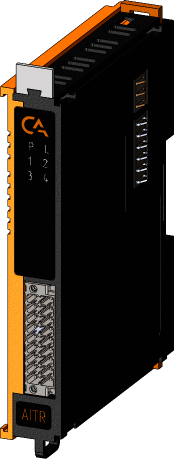

# Модуль аналогового ввода термосопротивления IPCSA-OG-AITR

## Общие сведения

??? note "Разработка"

    На текущий момент модуль на стадии разработки. Начало тестирования запланировано на апрель 2025 года

{ width="150" align=left  }
Модуль аналогового ввода термосопротивления (AITR) (арт. IPCSA-OG-AITR) является 4-х канальным модулем расширения и предназначен для получения и обработки сигналов от терморезисторов.  
Схемотехникой модуля предусмотрено 2-х, 3-х и 4-х проводное подключение терморезисторов, а также разъемы для подключения экранирующей оплетки от подводящих кабелей с терморезисторов.

## Технические характеристики 

| Характеристика                          | Значение                          |
|-----------------------------------------|-----------------------------------|
| Максимальная потребляемая мощность, Вт  | 3                                 |
| Количество входных каналов              | 4                                 |
| Типы термосопротивлений                 | См. таблицу 3                     |
| Ток возбуждения, мА                     | 1                                 |
| Схемы подключения                       | 4-х проводная, 3-х проводная, 2-х проводная |
| Время преобразования на все каналы, мс  | Не более 500                      |
| Погрешность модуля                      | См. таблицу 3                     |
| Разрядность АЦП, бит                    | 24                                |
| Гальваническая изоляция                 | Между входной и выходной логикой  |
| Тип проводника                          | Медный                            |
| Сечение проводника, мм²                 | От 0,2 до 1,5                     |
| Масса, г                                | 120                               |
| Габариты ВхШхГ, мм                      | 126х21х90                         |

## Типы поддерживаемых термосопротивлений

| Тип термопреобразователя сопротивления | Диапазон измерений, °С | Пределы допускаемой абсолютной погрешности, °С |
|----------------------------------------|-------------------------|-------------------------------------------------------------------------------------|
| Pt50 (α=0,00385)                       | от –200 до +850         | ±0,5                                                                               |
| Pt100 (α=0,00385)                      | от –200 до +850         | ±0,5                                                                               |
| 50П (α=0,00391)                        | от –200 до +850         | ±0,5                                                                               |
| 100П (α=0,00391)                       | от –200 до +850         | ±0,5                                                                               |
| 50М (α=0,00428)                        | от –50 до +200          | ±0,5                                                                               |
| 100М (α=0,00428)                       | от –50 до +200          | ±0,5                                                                               |
| 50Н (α=0,00617)                        | от –60 до +180          | ±0,5                                                                               |
| 100Н (α=0,00617)                       | от –60 до +180          | ±0,5                                                                               |

## Эксплуатационные характеристики
| Характеристика                   | Значение           |
| -------------------------------- | -                  |
| Температура эксплуатации, °С     | От минус 40 до 60  |
| Температура хранения, °С         | От минус 40 до 60  |
| Влажность при хранении, %	       | От 5 до 95         |
| Влажность при эксплуатации, %    | От 5 до 95         |
| Тип монтажа                      | На DIN-рейку 35 мм |
| Расположение при монтаже         | Вертикальное       |

## Схема подключения

{ width="370"; align=left  }

{ width="170";  }

1 - 4-х проводное подключение  
2 - 3-х проводное подключение  
3 - 2-х проводное подключение

Рекомендуется использовать 4-х проводное подключение.

| Обозначение | Наименование канала | Описание                                   |
|-------------|---------------------|-------------------------------------------|
| 1           | TC1+               | Плюс термопары 1                          |
| 2           | TC1-               | Минус термопары 1                         |
| 3           | TC2+               | Плюс термопары 2                          |
| 4           | TC2-               | Минус термопары 2                         |
| 5           | TC3+               | Плюс термопары 3                          |
| 6           | TC3-               | Минус термопары 3                         |
| 7           | TC4+               | Плюс термопары 4                          |
| 8           | TC4-               | Минус термопары 4                         |
| 9           | TC5+               | Плюс термопары 5                          |
| 10          | TC5-               | Минус термопары 5                         |
| 11          | TC6+               | Плюс термопары 6                          |
| 12          | TC6-               | Минус термопары 6                         |
| 13          | TC7+               | Плюс термопары 7                          |
| 14          | TC7-               | Минус термопары 7                         |
| 15          | RTD+               | Плюс термосопротивления                   |
| 16          | RTD-               | Минус термосопротивления                  |
| 17          | GND                | Допускается подключение экранирующей оплетки |
| 18          | GND                | Допускается подключение экранирующей оплетки |

## Индикация
{ width="50" }

| Обозначение | Индикация | Показатель |
|------------------|----------------------|---------------------------------------|
| P | :green_circle:| Наличие напряжения питания |
| P | :white_circle:| Отсутствие напряжения питания |
| L | :green_circle:| Наличие соединения Ethernet |
| L | :yellow_circle: :green_circle: :yellow_circle: | Обмен данными по Ethernet |
| L | :white_circle:| Отсутствие соединения Ethernet|
| 1 - 4 | :green_circle:| Датчик 1 - 4 подключен |
| 1 - 4 | :white_circle:| Датчик 1 - 4 отключен |

## Размеры

=== "Габаритные размеры" 
    { width="580"  }
=== "Установочные размеры"
     

## Программное обеспечение
Акутуальный конфигурационный файл можно скачать по 
<a href="../../downloads/IPCSA_OG.xml" download>ссылке</a>

