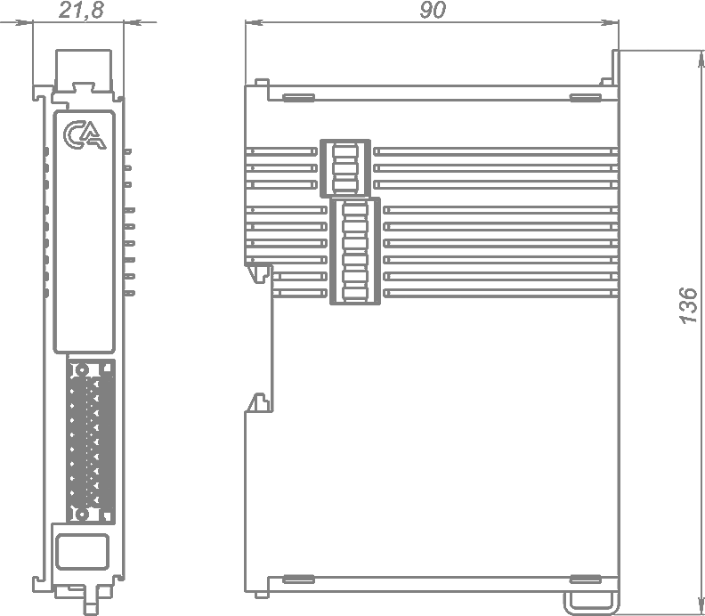

# Модуль аналогового ввода напряжения IPCSA-OG-AIV

## Общие сведения

??? example "Тестирование"

    На текущий момент модуль на стадии тестирования. Серийный выпуск запланирован на декабрь 2025 года 

<div class="grid cards" markdown>

{ width="150" align=left  }
Модуль аналогового ввода напряжения (AIV) (арт. IPCSA-OG-AIV) является 8-ми канальным модулем расширения и предназначен для получения аналоговых сигналов по напряжению от внешних источников напряжения
</div>

## Технические характеристики 
| Характеристика                          | Значение                          |
|-----------------------------------------|-----------------------------------|
| Максимальная потребляемая мощность, Вт  | 2,5                               |
| Количество входных каналов              | 8                                 |
| Входное сопротивление, МОм              | >1                                |
| Диапазон измеряемого напряжения, В      | от -10 до 10                      |
| Погрешность модуля, %                   | ±0.3 от полной шкалы              |
| Время преобразования на все каналы, мс  | 8                                 |
| Разрядность АЦП, бит                    | 16                                |
| Гальваническая изоляция                 | Между входной и выходной логикой  |
| Сечение проводника, мм²                 | От 0,2 до 1,5                     |
| Масса, г                                | 125                               |
| Габариты ВхШхГ, мм                      | 126х21,3х90                       |

## Эксплуатационные характеристики
| Характеристика                   | Значение           |
| -------------------------------- | -                  |
| Температура эксплуатации, °С     | От минус 40 до 60  |
| Температура хранения, °С         | От минус 40 до 60  |
| Влажность при хранении, %	       | От 5 до 95         |
| Влажность при эксплуатации, %    | От 5 до 95         |
| Тип монтажа                      | На DIN-рейку 35 мм |
| Расположение при монтаже         | Вертикальное       |

## Схема подключения

<div class="grid cards" markdown>
{ width="370"; align=left  }

{ width="170";  }
</div>

| Обозначение | Наименование канала | Описание          |
|-------------|---------------------|-------------------|
| 1           | AI1                 | Входной канал 1   |
| 2           | GND                 | Общий контакт     |
| 3           | AI2                 | Входной канал 2   |
| 4           | GND                 | Общий контакт     |
| 5           | AI3                 | Входной канал 3   |
| 6           | GND                 | Общий контакт     |
| 7           | AI4                 | Входной канал 4   |
| 8           | GND                 | Общий контакт     |
| 9           | AI5                 | Входной канал 5   |
| 10          | GND                 | Общий контакт     |
| 11          | AI6                 | Входной канал 6   |
| 12          | GND                 | Общий контакт     |
| 13          | AI7                 | Входной канал 7   |
| 14          | GND                 | Общий контакт     |
| 15          | AI8                 | Входной канал 8   |
| 16          | GND                 | Общий контакт     |
| 17          | GND                 | Общий контакт     |
| 18          | GND                 | Общий контакт     |


## Индикация
| Обозначение | Индикация | Показатель |
|------------------|----------------------|---------------------------------------|
| P | :green_circle:| Наличие напряжения питания |
| P | :white_circle:| Отсутствие напряжения питания |
| L | :green_circle:| Наличие соединения Ethernet |
| L | :yellow_circle: :green_circle: :yellow_circle: | Обмен данными по Ethernet |
| L | :white_circle:| Отсутствие соединения Ethernet|


## Размеры

=== "Габаритные размеры" 
    { width="580"  }
=== "Установочные размеры"
     

## 3D-модель
<model-viewer src="https://xn--j1abl.online//img/3d/DI.glb"
alt="3D Model"
auto-rotate
camera-controls
poster="https://xn--j1abl.online//img/3d/posterDI.webp"
camera-orbit="160deg 75deg 348m"
field-of-view="30deg"
exposure="0.5"
style="width: 100%; height: 500px;">
</model-viewer>

## Программное обеспечение
Актуальный конфигурационный файл можно скачать по 
<a href="../../downloads/IPCSA_OG.xml" download>ссылке</a>

``` dtd title="PDO"
SM0: PhysAddr 0x1000, DefaultSize  128, ControlRegister 0x26, Enable 1
SM1: PhysAddr 0x1080, DefaultSize  128, ControlRegister 0x22, Enable 1
SM2: PhysAddr 0x1100, DefaultSize    0, ControlRegister 0x24, Enable 1
SM3: PhysAddr 0x1180, DefaultSize   32, ControlRegister 0x20, Enable 1
  TxPDO 0x1a00 "Current inputs (PDO)"
    PDO entry 0x6000:01, 32 bit, "Channel 1"
    PDO entry 0x6000:02, 32 bit, "Channel 2"
    PDO entry 0x6000:03, 32 bit, "Channel 3"
    PDO entry 0x6000:04, 32 bit, "Channel 4"
    PDO entry 0x6000:05, 32 bit, "Channel 5"
    PDO entry 0x6000:06, 32 bit, "Channel 6"
    PDO entry 0x6000:07, 32 bit, "Channel 7"
    PDO entry 0x6000:08, 32 bit, "Channel 8"
```

``` dtd title="SDO"
SDO 0x1000, "Device Type"
  0x1000:00, r-r-r-, uint32, 32 bit, "Device Type"
SDO 0x1008, "Device Name"
  0x1008:00, r-r-r-, string, 104 bit, "Device Name"
SDO 0x1009, "Hardware Version"
  0x1009:00, r-r-r-, string, 48 bit, "Hardware Version"
SDO 0x100a, "Software Version"
  0x100a:00, r-r-r-, string, 48 bit, "Software Version"
SDO 0x1018, "Identity Object"
  0x1018:00, r-r-r-, uint8, 8 bit, "Number of entries"
  0x1018:01, r-r-r-, uint32, 32 bit, "Vendor ID"
  0x1018:02, r-r-r-, uint32, 32 bit, "Product Code"
  0x1018:03, r-r-r-, uint32, 32 bit, "Revision Number"
  0x1018:04, r-r-r-, uint32, 32 bit, "Serial Number"
SDO 0x1a00, "Current inputs (PDO)"
  0x1a00:00, r-r-r-, uint8, 8 bit, "Number of entries"
  0x1a00:01, r-r-r-, uint32, 32 bit, "Mapped object"
  0x1a00:02, r-r-r-, uint32, 32 bit, "Mapped object"
  0x1a00:03, r-r-r-, uint32, 32 bit, "Mapped object"
  0x1a00:04, r-r-r-, uint32, 32 bit, "Mapped object"
  0x1a00:05, r-r-r-, uint32, 32 bit, "Mapped object"
  0x1a00:06, r-r-r-, uint32, 32 bit, "Mapped object"
  0x1a00:07, r-r-r-, uint32, 32 bit, "Mapped object"
  0x1a00:08, r-r-r-, uint32, 32 bit, "Mapped object"
SDO 0x1c00, "Sync Manager Communication type"
  0x1c00:00, r-r-r-, uint8, 8 bit, "Number of entries"
  0x1c00:01, r-r-r-, uint8, 8 bit, "Communications type SM0"
  0x1c00:02, r-r-r-, uint8, 8 bit, "Communications type SM1"
  0x1c00:03, r-r-r-, uint8, 8 bit, "Communications type SM2"
  0x1c00:04, r-r-r-, uint8, 8 bit, "Communications type SM3"
SDO 0x1c10, "Sync Manager 0 PDO Assignment"
  0x1c10:00, r-r-r-, uint8, 8 bit, "Sync Manager 0 PDO Assignment"
SDO 0x1c11, "Sync Manager 1 PDO Assignment"
  0x1c11:00, r-r-r-, uint8, 8 bit, "Sync Manager 1 PDO Assignment"
SDO 0x1c12, "Sync Manager 2 PDO Assignment"
  0x1c12:00, r-r-r-, uint8, 8 bit, "Number of entries"
  0x1c12:01, r-r-r-, uint16, 16 bit, "Mapped object"
SDO 0x1c13, "Sync Manager 3 PDO Assignment"
  0x1c13:00, r-r-r-, uint8, 8 bit, "Number of entries"
  0x1c13:01, r-r-r-, uint16, 16 bit, "Mapped object"
SDO 0x6000, "Input voltage"
  0x6000:00, r-r-r-, uint8, 8 bit, "Number of entries"
  0x6000:01, r-r-r-, float, 32 bit, "Channel 1"
  0x6000:02, r-r-r-, float, 32 bit, "Channel 2"
  0x6000:03, r-r-r-, float, 32 bit, "Channel 3"
  0x6000:04, r-r-r-, float, 32 bit, "Channel 4"
  0x6000:05, r-r-r-, float, 32 bit, "Channel 5"
  0x6000:06, r-r-r-, float, 32 bit, "Channel 6"
  0x6000:07, r-r-r-, float, 32 bit, "Channel 7"
  0x6000:08, r-r-r-, float, 32 bit, "Channel 8"
SDO 0x8001, "Filtering" 
  0x8001:00, r-r-r-, uint8, 8 bit, "Number of entries"
  0x8001:01, rwrwrw, uint8, 8 bit, "Average samples 1" <!--(1)!-->
  0x8001:02, rwrwrw, uint8, 8 bit, "Average samples 2"
  0x8001:03, rwrwrw, uint8, 8 bit, "Average samples 3"
  0x8001:04, rwrwrw, uint8, 8 bit, "Average samples 4"
  0x8001:05, rwrwrw, uint8, 8 bit, "Average samples 5"
  0x8001:06, rwrwrw, uint8, 8 bit, "Average samples 6"
  0x8001:07, rwrwrw, uint8, 8 bit, "Average samples 7"
  0x8001:08, rwrwrw, uint8, 8 bit, "Average samples 8"
SDO 0x8002, "Range Setting"
  0x8002:00, r-r-r-, uint8, 8 bit, "Number of entries"
  0x8002:01, rwrwrw, uint8, 8 bit, "Input Range" <!--(2)!-->
SDO 0x9001, "Module parameters"
  0x9001:00, r-r-r-, uint8, 8 bit, "Number of entries"
  0x9001:01, r-r-r-, uint16, 16 bit, "Metrology CRC16"  
```

1. В модуле реализовано фильтрация методом "Скользящего среднего" измеренных значений. Данная настройка позволяет изменять ширину окна выборки, минимальное значение - 1 (фильтрация выключена), максимальное - 255, по умолчанию - 16. 
2. Эта настройка позволяет изменить диапазон измеряемого напряжения, чем меньше диапазон, тем выше точность измерения.:warning: Настройка применяется ко всем каналам!


``` c title="Ethercat cstruct"
/* Master 0, Slave 0, "IPCSA-OG-AIV"
 * Vendor ID:       0x00000001
 * Product code:    0x01009252
 * Revision number: 0x00000001
 */

ec_pdo_entry_info_t slave_0_pdo_entries[] = {
    {0x6000, 0x01, 32}, /* Channel 1 */
    {0x6000, 0x02, 32}, /* Channel 2 */
    {0x6000, 0x03, 32}, /* Channel 3 */
    {0x6000, 0x04, 32}, /* Channel 4 */
    {0x6000, 0x05, 32}, /* Channel 5 */
    {0x6000, 0x06, 32}, /* Channel 6 */
    {0x6000, 0x07, 32}, /* Channel 7 */
    {0x6000, 0x08, 32}, /* Channel 8 */
};

ec_pdo_info_t slave_0_pdos[] = {
    {0x1a00, 8, slave_0_pdo_entries + 0}, /* Current inputs (PDO) */
};

ec_sync_info_t slave_0_syncs[] = {
    {0, EC_DIR_OUTPUT, 0, NULL, EC_WD_DISABLE},
    {1, EC_DIR_INPUT, 0, NULL, EC_WD_DISABLE},
    {2, EC_DIR_OUTPUT, 0, NULL, EC_WD_DISABLE},
    {3, EC_DIR_INPUT, 1, slave_0_pdos + 0, EC_WD_DISABLE},
    {0xff}
};
```


