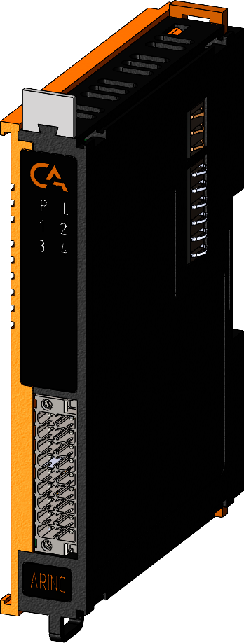

# Модуль интерфейсный IPCSA-OG-IFARINC

## Общие сведения

??? example "Разработка"

    На текущий момент модуль на стадии разработки. Начало тестирования запланированно на апрель 2025 года 

<div class="grid cards" markdown>

{ width="150" align=left  }
 Модуль интерфейсный ARINC (IFARINC) (арт. IPCSA-OG-AIFARINC) является модулем расширения, осуществлет подключение и работу ПЛК с интерфейсом ARINC-429.
</div>

## Технические характеристики 
| Характеристика                                      | Значение                                       |
|----------------------------------------------------|-----------------------------------------------|
| Максимальная потребляемая мощность, Вт            | -                                             |
| Количество входных каналов                        | 2                                             |
| Количество выходных каналов                       | 1                                             |
| Сигнал на выходе, В                               | ± 5                                           |
| Количество подключаемых интерфейсов ARINC-429, шт | 1                                             |
| Гальваническая изоляция                           | Между входной и выходной логикой              |
| Скорость передачи данных, Кбит/с                  | 100                                           |
| Максимальная длина подключаемого кабеля, м        | 100                                           |
| Тип проводника                                    | Медный                                        |
| Сечение проводника, мм²                           | От 0,2 до 1,5                                 |
| Масса, г                                          | 125                                           |
| Габариты В×Ш×Г, мм                                | 126×21,3×90                                   |

## Эксплуатационные характеристики
| Характеристика                   | Значение           |
| -------------------------------- | -                  |
| Температура эксплуатации, °С     | От минус 40 до 60  |
| Температура хранения, °С         | От минус 40 до 60  |
| Влажность при хранении, %	       | От 5 до 95         |
| Влажность при эксплуатации, %    | От 5 до 95         |
| Тип монтажа                      | На DIN-рейку 35 мм |
| Расположение при монтаже         | Вертикальное       |

## Схема подключения

<div class="grid cards" markdown>
{ width="370"; align=left  }

{ width="170";  }
</div>

Контакты «GND_DRY» и «GND_WET» предназначены для подключения входов по принципу «сухого» или «мокрого» контакта соответственно.

| Обозначение | Название канала | Описание                       |
|-------------|-----------------|--------------------------------|
| 1 - 16      | DO1 - OD16      | Входной канал 1 - 16          |
| 17          | G_WET             | Общий контакт при подклбчении по схеме "мокрый контакт"|
| 18          | G_DRY            | Общий контакт при подклбчении по схеме "сухой контакт" |

## Индикация
{ width="50" }


| Обозначение | Индикация | Показатель |
|------------------|----------------------|---------------------------------------|
| P | :green_circle:| Наличие напряжения питания |
| P | :white_circle:| Отсутствие напряжения питания |
| L | :green_circle:| Наличие соединения Ethernet |
| L | :yellow_circle: :green_circle: :yellow_circle: | Обмен данными по Ethernet |
| L | :white_circle:| Отсутствие соединения Ethernet|
| 1-4 | :green_circle:| Информация ожидается  |
| 1-4 | :white_circle:| Информация ожидается  |

## Размеры

=== "Габаритные размеры" 
    { width="580"}
=== "Установочные размеры"
     

## Программное обеспечение
Акутуальный конфигурационный файл можно скачать по 
<a href="../../downloads/ipcsa_modules_config.xml" download>ссылке</a>


### Информация PDO модуля на языке C

``` c title="Ethercat cstruct"
/* Master 0, Slave 0, "LAN9252-DIGIO-2PORT-BIDIR"
 * Vendor ID:       0xe00004d8
 * Product code:    0x00000021
 * Revision number: 0x00000001
 */

ec_pdo_entry_info_t slave_0_pdo_entries[] = {
    {0x3101, 0x01, 8}, /* Output */
    {0x3101, 0x02, 8}, /* Output */
};

ec_pdo_info_t slave_0_pdos[] = {
    {0x1a00, 1, slave_0_pdo_entries + 0}, /* Byte 0 */
    {0x1a01, 1, slave_0_pdo_entries + 1}, /* Byte 0 */
};

ec_sync_info_t slave_0_syncs[] = {
    {0, EC_DIR_OUTPUT, 2, slave_0_pdos + 0, EC_WD_ENABLE},
    {1, EC_DIR_OUTPUT, 0, NULL, EC_WD_ENABLE},
    {0xff}
};
``` 
### Адреса регистов в ожидании разработки
|Тип|Индекс|Адрес|Описание|
|-|-|-|-|
|ТxPDO |0x1a00|0x6000|Состояние 1-8 контактов в ввиде битовой маски|
| TxPDO |0x1a00|0x6000:1| Состояние 1 контакта (1 - замкнут, 0 - разомкнут)|
| TxPDO |0x1a00|0x6000:2| Состояние 2 контакта (1 - замкнут, 0 - разомкнут)|
| TxPDO |0x1a00|0x6000:3| Состояние 3 контакта (1 - замкнут, 0 - разомкнут)|
| TxPDO |0x1a00|0x6000:4| Состояние 4 контакта (1 - замкнут, 0 - разомкнут)|
| TxPDO |0x1a00|0x6000:5| Состояние 5 контакта (1 - замкнут, 0 - разомкнут)|
| TxPDO |0x1a00|0x6000:6| Состояние 6 контакта (1 - замкнут, 0 - разомкнут)|
| TxPDO |0x1a00|0x6000:7| Состояние 7 контакта (1 - замкнут, 0 - разомкнут)|
| TxPDO |0x1a00|0x6000:8| Состояние 8 контакта (1 - замкнут, 0 - разомкнут)|
| TxPDO |0x1a08|0x6080| Состояние 9-16 контактов в ввиде битовой маски|
| TxPDO |0x1a08|0x6080:1| Состояние 9 контакта (1 - замкнут, 0 - разомкнут)|
| TxPDO |0x1a08|0x6080:2| Состояние 10 контакта (1 - замкнут, 0 - разомкнут)|
| TxPDO |0x1a08|0x6080:3| Состояние 11 контакта (1 - замкнут, 0 - разомкнут)|
| TxPDO |0x1a08|0x6080:4| Состояние 12 контакта (1 - замкнут, 0 - разомкнут)|
| TxPDO |0x1a08|0x6080:5| Состояние 13 контакта (1 - замкнут, 0 - разомкнут)|
| TxPDO |0x1a08|0x6080:6| Состояние 14 контакта (1 - замкнут, 0 - разомкнут)|
| TxPDO |0x1a08|0x6080:7| Состояние 15 контакта (1 - замкнут, 0 - разомкнут)|
| TxPDO |0x1a08|0x6080:8| Состояние 16 контакта (1 - замкнут, 0 - разомкнут)|


