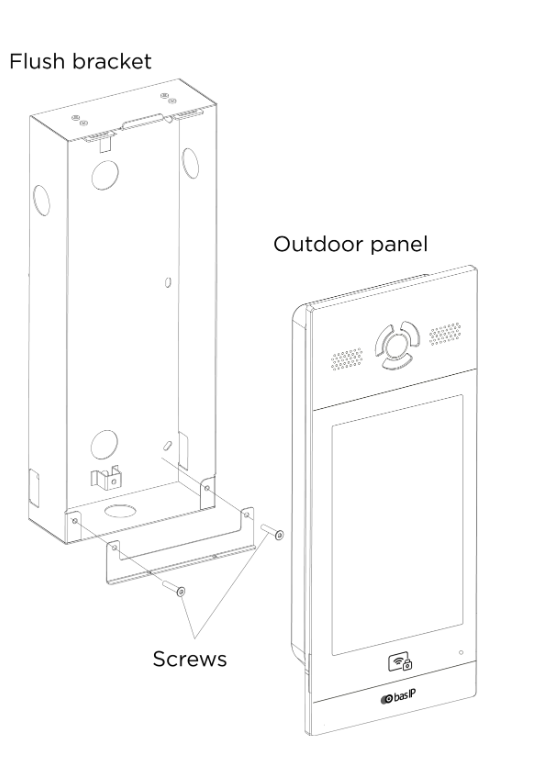

# Дисплей 13 дюймов IPCSA-OG-DISPLAY13

## Общие сведения

??? abstract "Формирование задания"

    На текущий момент модуль на стадии формирования технического задания. Начало разработки запланировано на февраль 2025 года 

{ width="150" align=left  }
Дисплей 13 дюймов (арт. IPCSA-OG-DISPLAY13) является сенсорным 13 дюймовым дисплеем, предназначенном для ввода и вывода информации

## Технические характеристики 
| Характеристика                          | Значение                     |
|-----------------------------------------|------------------------------|
| Питание | POE, DC не хуже 24 - 48 В|
| Материал корпуса лицевой панели | Аллюминий                            |
| Материал настенного крепления            | Аллюминий                       |
| Материалл задней стенки     | Пластик                           |
| Толщина рамок передней панели | минимальные                  |
| Крепежные размеры настенного крепления  | 100 х 100 мм, 75 х 75 мм (стандартное крепление монитора), 60 мм (европейский подрозетник)                           |

## Эксплуатационные характеристики
| Характеристика                   | Значение           |
| -------------------------------- | -                  |
| Температура эксплуатации, °С     | От минус 40 до 60  |
| Температура хранения, °С         | От минус 40 до 60  |
| Влажность при хранении, %	       | От 5 до 95         |
| Влажность при эксплуатации, %    | От 5 до 95         |
| Тип монтажа                      | В отверстие, на стену |
| Расположение при монтаже         | Горизонтальное, вертикальное  |

