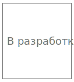

# Модуль дискретного вывода ШИМ IPCSA-OG-DPWM

## Общие сведения

??? note "Разработка"
    На текущий момент модуль на стадии разработки. Начало тестирования запланировано на июнь 2025 года

{ width="150" align=left  }
Модуль дискретных выходов ШИМ (арт. IPCSA-OG-DPWM) является 16-ти канальным модулем расширения и предназначен для вывода сигнала с широтно-импульсной модуляцией.
Модуль должен быть оснащен клеммами подключения внешнего источника питания.

## Технические характеристики 
| Характеристика                          | Значение                     |
|-----------------------------------------|------------------------------|
| Количество выходных каналов             | 16                           |
| Выходное напряжение контактов           | от 2 до 30 В ( равняется напряжению поданно-му на контакты V+ и GND)|
| Частота ШИМ не менее | 20 кГц           |
|  Шагов скважности ШИМ не менее           | 200    (лучше больше)      |
| Максимальный ток логической единицы, мА/канал | Не менее 200           |
| Гальваническая изоляция                | Между входной и выходной логикой |
| Сечение проводника, мм²                | От 0,2 до 1,5                 |
| Масса, г                               | 125                           |
| Габариты ВхШхГ, мм                     | 126х21,3х90                   |

## Эксплуатационные характеристики
| Характеристика                   | Значение           |
| -------------------------------- | -                  |
| Температура эксплуатации, °С     | От минус 40 до 60  |
| Температура хранения, °С         | От минус 40 до 60  |
| Влажность при хранении, %	       | От 5 до 95         |
| Влажность при эксплуатации, %    | От 5 до 95         |
| Тип монтажа                      | На DIN-рейку 35 мм |
| Расположение при монтаже         | Вертикальное       |

## Схема подключения

{ width="370"; align=left  }
{ width="170";  }

| Обозначение | Название канала | Описание                 |
|-------------|-----------------|--------------------------|
| 1 - 16      | PWM1 - PWM16      | Выходной канал 1 - 16  |
| 17          | V+              | "+" внешнего питания     |
| 18          | GND             | "-" внешнего питания     |

## Индикация
| Обозначение | Индикация | Показатель |
|------------------|----------------------|---------------------------------------|
| P | :green_circle:| Наличие напряжения питания |
| P | :white_circle:| Отсутствие напряжения питания |
| L | :green_circle:| Наличие соединения Ethernet |
| L | :yellow_circle: :green_circle: :yellow_circle: | Обмен данными по Ethernet |
| L | :white_circle:| Отсутствие соединения Ethernet|
| 1-16 | :green_circle:| Контакт «1», «2», ..., «16» замкнут (реализовать программно) |
| 1-16 | :white_circle:| Контакт «1», «2», ..., «16» разомнут (реализовать программно)|

## Размеры

=== "Габаритные размеры" 
    { width="580"}
=== "Установочные размеры"
     

## 3D-модель
<model-viewer src="https://xn--j1abl.online//img/3d/DI.glb"
alt="3D Model"
auto-rotate
camera-controls
poster="https://xn--j1abl.online//img/3d/posterDI.webp"
camera-orbit="160deg 75deg 348m"
field-of-view="30deg"
exposure="0.5"
style="width: 100%; height: 500px;">
</model-viewer>

## Программное обеспечение
Актуальный конфигурационный файл можно скачать по 
<a href="../../downloads/IPCSA_OG.xml" download>ссылке</a>

 
### Адреса регистов
|Описание|Тип|Индекс|Адрес|Тип данных|Примечание|
|-|-|-|-|-|-|
| Скважность 1 канала | RxPDO |?|?|USIGNED16|0 - 100%| 
| Скважность 2 канала | RxPDO |?|?|USIGNED16|0 - 100%| 
| Скважность 3 канала | RxPDO |?|?|USIGNED16|0 - 100%| 
| Скважность 4 канала | RxPDO |?|?|USIGNED16|0 - 100%| 
| Скважность 5 канала | RxPDO |?|?|USIGNED16|0 - 100%| 
| Скважность 6 канала | RxPDO |?|?|USIGNED16|0 - 100%| 
| Скважность 7 канала | RxPDO |?|?|USIGNED16|0 - 100%| 
| Скважность 8 канала | RxPDO |?|?|USIGNED16|0 - 100%| 
| Скважность 9 канала | RxPDO |?|?|USIGNED16|0 - 100%| 
| Скважность 10 канала | RxPDO |?|?|USIGNED16|0 - 100%| 
| Скважность 11 канала | RxPDO |?|?|USIGNED16|0 - 100%| 
| Скважность 12 канала | RxPDO |?|?|USIGNED16|0 - 100%| 
| Скважность 13 канала | RxPDO |?|?|USIGNED16|0 - 100%| 
| Скважность 14 канала | RxPDO |?|?|USIGNED16|0 - 100%| 
| Скважность 15 канала | RxPDO |?|?|USIGNED16|0 - 100%| 
| Скважность 16 канала | RxPDO |?|?|USIGNED16|0 - 100%| 
| Частота ШИМ 1 канала | SDO |?|?|USIGNED16|| 
| Частота ШИМ 2 канала | SDO |?|?|USIGNED16||
| Частота ШИМ 3 канала | SDO |?|?|USIGNED16||
| Частота ШИМ 4 канала | SDO |?|?|USIGNED16||
| Частота ШИМ 5 канала | SDO |?|?|USIGNED16||
| Частота ШИМ 6 канала | SDO |?|?|USIGNED16||
| Частота ШИМ 7 канала | SDO |?|?|USIGNED16||
| Частота ШИМ 8 канала | SDO |?|?|USIGNED16||
| Частота ШИМ 9 канала | SDO |?|?|USIGNED16||
| Частота ШИМ 10 канала | SDO |?|?|USIGNED16||
| Частота ШИМ 11 канала | SDO |?|?|USIGNED16||
| Частота ШИМ 12 канала | SDO |?|?|USIGNED16||
| Частота ШИМ 13 канала | SDO |?|?|USIGNED16||
| Частота ШИМ 14 канала | SDO |?|?|USIGNED16||
| Частота ШИМ 15 канала | SDO |?|?|USIGNED16||
| Частота ШИМ 16 канала | SDO |?|?|USIGNED16||