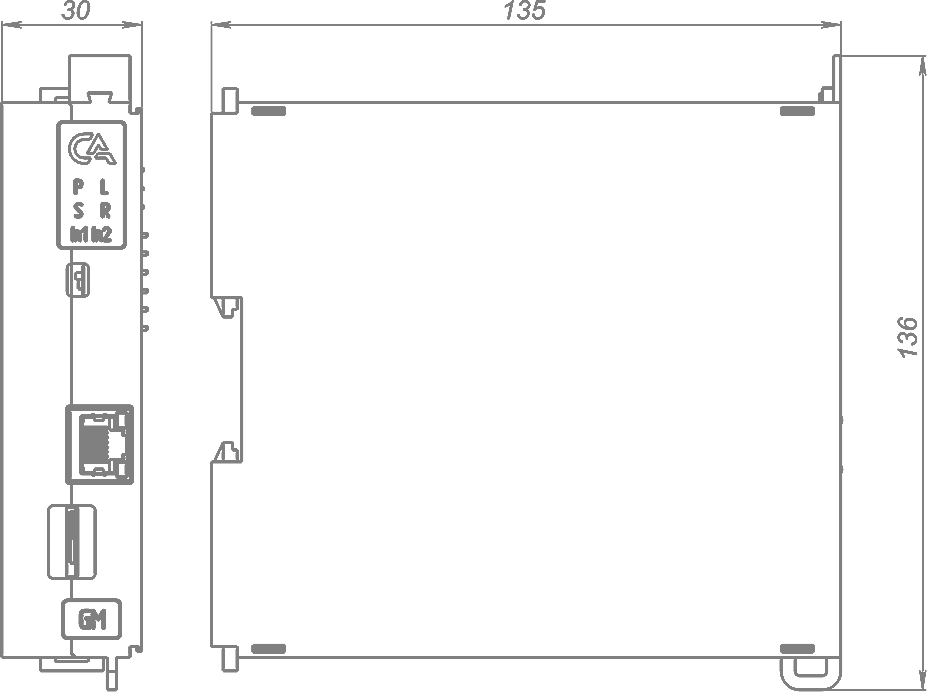
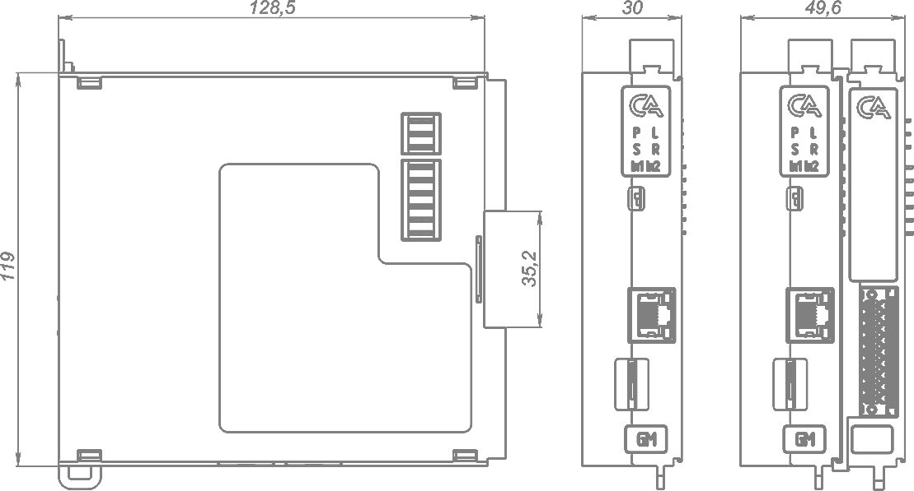

# Модуль основной SA-P5-GM

## Общие сведения

??? note "Разработка"

    На текущий момент модуль на стадии разработки. Начало тестирования запланировано на апрель 2025 года

{ width="150" align=left  }
Модуль основной GM (арт. SA-P5-GM) является центральным компонентом системы управления.

### Модуль основной выполняет следующие ключевые функции:
* выполнение программы управления;
* опрос модулей расширения;
* подключение сторонних модулей и датчиков по Ethernet;
* обеспечение питания модулей расширения.

## Технические характеристики 
| Характеристика | Значение |
| - | - |
| Максимальная потребляемая мощность, Вт |	7,5
| Номинальное напряжение питания, | В	24
| Диапазон напряжения питания, | В	от 20 до 28
| Резервирование питания 	| Поддерживается
| Индикация при перенапряжении/ недостаточном напряжении |	Да
| Защита при перегрузке по току |	Да
| Максимальное число модулей расширения |	63
| Поддерживаемые интерфейсы |	Ethernet 1000 Мбит/с – 1 (на лицевой части) Ethernet 100 Мбит/с – 2 (на нижней части) microSD – 1 |
| Ядро |	Cortex A55 |
| Оперативная память, Гб |	4, DDR4 |
| Объем памяти, Гб |	32 |
| Питание модулей расширения, Вт |	до 40 (см. Организации питания модулей) |
| Гальваническая изоляция | Между входной и выходной логикой |
| Сечение проводника, мм2 | От 0,5 до 1,5 |
| Масса, г |	200 |
|Габариты ВхШхГ, мм |	126х30х135 |

## Эксплуатационные характеристики
| Характеристика                   | Значение           |
| -------------------------------- | -                  |
| Температура эксплуатации, °С     | От минус 40 до 60  |
| Температура хранения, °С         | От минус 40 до 60  |
| Влажность при хранении, %	       | От 5 до 95         |
| Влажность при эксплуатации, %    | От 5 до 95         |
| Тип монтажа                      | На DIN-рейку 35 мм |
| Расположение при монтаже         | Вертикальное       |

## Схема подключения

{ width="355"; align=left  }

{ width="180";  }

| Обозначение | Наименование канала | Описание |
| ----------- | - | --|
| 1 | +24В_1 | Подключение внеш-него питания 1 |
| 2 | +24В_2 | Подключение внеш-него питания 2 | 
| 3 | GND | Общий контакт | 
| 4 | GND | Общий контакт|
| 5 | FG | Защитное заземление |
| 6 | FG | Защитное заземление |

???+ warning "Предупреждение"

    Без подключения защитного заземления не использовать

## Индикация
{ width="50" }

| Обозначение | Индикация | Показатель |
|------------------|----------------------|---------------------------------------|
| P | :green_circle:| Наличие напряжения питания |
| P | :white_circle:| Отсутствие напряжения питания |
| L | :green_circle:| Наличие соединения Ethernet |
| L | :yellow_circle: :green_circle: :yellow_circle: | Обмен данными по Ethernet |
| L | :white_circle:| Отсутствие соединения Ethernet|
| S | :green_circle:| Внутреннее питание в нормальном режиме |
| S | :red_circle:| Внутреннее питание в аварийном режиме |
| S | :white_circle:| Питание отсутствует|
| R | :green_circle:| Тумблер режима работы в положении «RUN» |
| R | :red_circle:| Тумблер режима работы в положении «STOP» |
| In1 | :green_circle:| Наличие внешнего питания 1 |
| In1 | :white_circle:| Отсутствие внешнего питания 1 |
| In2 | :green_circle:| Наличие внешнего питания 2 |
| In2 | :white_circle:| Отсутствие внешнего питания 2 |

## Размеры

=== "Габаритные размеры" 
    { width="580"}
=== "Установочные размеры"
     
