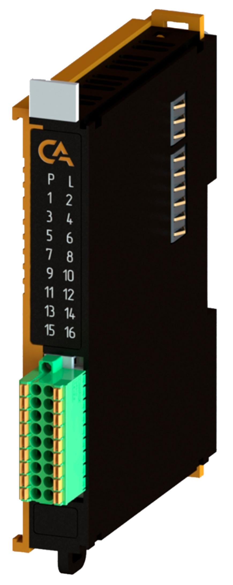
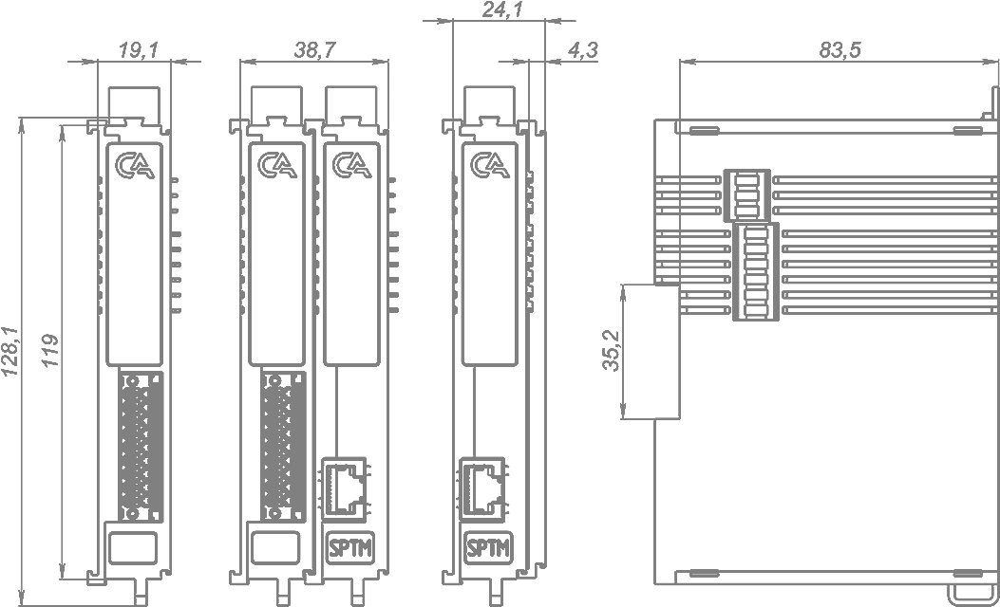

# Модуль интерфейсный CAN REMA-P5-IF232

## Общие сведения

??? note "Разработка"
    На текущий момент модуль на стадии разработки. Начало тестирования запланировано на апрель 2025 года

{ width="150" align=left  }
Модуль интерфейса IFCAN (арт. REMA-P5-IFCAN) является 2-канальным модулем расширения и предназначен для обмена данными по интерфейсу CAN

## Технические характеристики 
| Характеристика                             | Значение                          |
|--------------------------------------------|-----------------------------------|
| Максимальная потребляемая мощность, Вт     | 2,5                               |
| Количество подключаемых интерфейсов RS-232 | 2                                 |
| Скорость передачи данных, Мбит/с           | до 20 по каждому интерфейсу       |
| Максимальная длина кабеля, м               | 150                               |
| Сечение проводника, мм²                    | От 0,2 до 1,5                     |
| Масса, г                                   | 120                               |
| Габариты ВхШхГ, мм                         | 126х21х90                         |

## Эксплуатационные характеристики
| Характеристика                   | Значение           |
| -------------------------------- | -                  |
| Температура эксплуатации, °С     | От минус 40 до 60  |
| Температура хранения, °С         | От минус 40 до 60  |
| Влажность при хранении, %	       | От 5 до 95         |
| Влажность при эксплуатации, %    | От 5 до 95         |
| Тип монтажа                      | На DIN-рейку 35 мм |
| Расположение при монтаже         | Вертикальное       |

## Схема подключения

{ width="370"; align=left  }

{ width="170";  }

| Обозначение | Наименование канала | Описание                            |
|-------------|---------------------|-------------------------------------|
| 1           | TX1                 | Передача данных 1 интерфейса RS-232 |
| 2           | RX1                 | Прием данных 1 интерфейса RS-232    |
| 3           | TX2                 | Передача данных 2 интерфейса RS-232 |
| 4           | RX2                 | Прием данных 2 интерфейса RS-232    |
| 5           | GND                 | Общий контакт интерфей-са RS-422    |
| 6           | GND                 | Общий контакт интерфей-са RS-422    |
| 7           | GND                 | Общий контакт                       |
| 8           | GND                 | Общий контакт                       |
| 9           | GND                 | Общий контакт                       |
| 10          | GND                 | Общий контакт                       |
| 11          | GND                 | Общий контакт                       |
| 12          | GND                 | Общий контакт                       |
| 13          | GND                 | Общий контакт                       |
| 14          | GND                 | Общий контакт                       |
| 15          | GND                 | Общий контакт                       |
| 16          | GND                 | Общий контакт                       |
| 17          | GND                 | Общий контакт                       |
| 18          | GND                 | Общий контакт                       |

## Индикация
| Обозначение | Индикация | Показатель |
|------------------|----------------------|---------------------------------------|
| P | :green_circle:| Наличие напряжения питания |
| P | :white_circle:| Отсутствие напряжения питания |
| L | :green_circle:| Наличие соединения Ethernet |
| L | :yellow_circle: :green_circle: :yellow_circle: | Обмен данными по Ethernet |
| L | :white_circle:| Отсутствие соединения Ethernet|

## Размеры
=== "Габаритные размеры" 
    { width="580"}
=== "Установочные размеры"
     

## 3D-модель
<model-viewer src="https://manual.saplc.ru//img/3d/DI.glb"
alt="3D Model"
auto-rotate
camera-controls
poster="https://manual.saplc.ru//img/3d/posterDI.webp"
camera-orbit="160deg 75deg 348m"
field-of-view="30deg"
exposure="0.5"
style="width: 100%; height: 500px;">
</model-viewer>

## Файлы для скачивания
<a href="/downloads/IPCSA_OG.xml" download>XML конфигурационный файл для TwinCAT</a>     
<a href="/downloads/Module 18-pin.step" download>3D-модель</a>   
<a href="/downloads/Module 18-pin.dwg" download>2D-модель</a>    