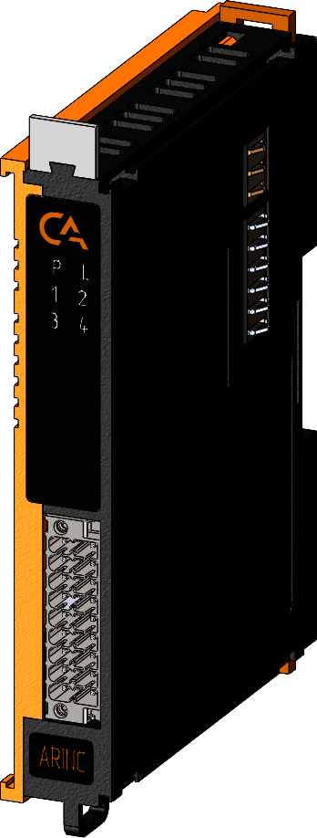

# Модуль интерфейсный SA-P5-IFARINC

## Общие сведения

??? example "Разработка"
    На текущий момент модуль на стадии разработки. Начало тестирования запланированно на апрель 2025 года 

{ width="150" align=left  }
 Модуль интерфейсный ARINC (арт. SA-P5-AIFARINC) является модулем расширения, осуществлет подключение и работу ПЛК с интерфейсом ARINC-429.

## Технические характеристики 
| Характеристика                                      | Значение                                       |
|----------------------------------------------------|-----------------------------------------------|
| Максимальная потребляемая мощность, Вт            | -                                             |
| Количество входных каналов                        | 2                                             |
| Количество выходных каналов                       | 1                                             |
| Сигнал на выходе, В                               | ± 5                                           |
| Количество подключаемых интерфейсов ARINC-429, шт | 1                                             |
| Гальваническая изоляция                           | Между входной и выходной логикой              |
| Скорость передачи данных, Кбит/с                  | 100                                           |
| Максимальная длина подключаемого кабеля, м        | 100                                           |
| Сечение проводника, мм²                           | От 0,2 до 1,5                                 |
| Масса, г                                          | 125                                           |
| Габариты В×Ш×Г, мм                                | 126×21,3×90                                   |

## Эксплуатационные характеристики
| Характеристика                   | Значение           |
| -------------------------------- | -                  |
| Температура эксплуатации, °С     | От минус 40 до 60  |
| Температура хранения, °С         | От минус 40 до 60  |
| Влажность при хранении, %	       | От 5 до 95         |
| Влажность при эксплуатации, %    | От 5 до 95         |
| Тип монтажа                      | На DIN-рейку 35 мм |
| Расположение при монтаже         | Вертикальное       |

## Схема подключения

{ width="370"; align=left  }

{ width="170";  }

Контакты «GND_DRY» и «GND_WET» предназначены для подключения входов по принципу «сухого» или «мокрого» контакта соответственно.

| Обозначение | Название канала | Описание                       |
|-------------|-----------------|--------------------------------|
| 1 - 16      | DO1 - OD16      | Входной канал 1 - 16          |
| 17          | G_WET             | Общий контакт при подклбчении по схеме "мокрый контакт"|
| 18          | G_DRY            | Общий контакт при подклбчении по схеме "сухой контакт" |

## Индикация
| Обозначение | Индикация | Показатель |
|------------------|----------------------|---------------------------------------|
| P | :green_circle:| Наличие напряжения питания |
| P | :white_circle:| Отсутствие напряжения питания |
| L | :green_circle:| Наличие соединения Ethernet |
| L | :yellow_circle: :green_circle: :yellow_circle: | Обмен данными по Ethernet |
| L | :white_circle:| Отсутствие соединения Ethernet|
| 1-4 | :green_circle:| Информация ожидается  |
| 1-4 | :white_circle:| Информация ожидается  |

## Размеры
=== "Габаритные размеры" 
    { width="580"}
=== "Установочные размеры"
     

## 3D-модель
<model-viewer src="https://manual.saplc.ru//img/3d/DI.glb"
alt="3D Model"
auto-rotate
camera-controls
poster="https://manual.saplc.ru//img/3d/posterDI.webp"
camera-orbit="160deg 75deg 348m"
field-of-view="30deg"
exposure="0.5"
style="width: 100%; height: 500px;">
</model-viewer>

## Программное обеспечение
Актуальный конфигурационный файл можно скачать по 
<a href="../../downloads/IPCSA_OG.xml" download>ссылке</a>

## Файлы для скачивания
<a href="/downloads/IPCSA_OG.xml" download>XML конфигурационный файл для TwinCAT</a>      
<a href="/downloads/Module 18-pin.step" download>3D-модель</a>   
<a href="/downloads/Module 18-pin.dwg" download>2D-модель</a>    