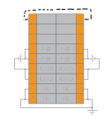

# Модуль ввода питания IPCSA-OG-SPPM

## Общие сведения

??? example "Тестирование"
    На текущий момент модуль на стадии тестирования. Серийный выпуск запланирован на декабрь 2025 года 

{ width="150" align=left  }
Модуль ввода дополнительного питания (SPPM) (арт. IPCSA-OG-SPPM) является модулем расширения и предназначен для обеспечения питания модулей.
Модуль ввода дополнительного питания обеспечивает мощность питания до 48 Вт. Для обеспечения бесперебойного питания модулей от внешних источников питания, модуль SPPM поддерживает резервирование питания от 2-х независимых источников питания.
Функционал модуля позволяет детектировать повышенное и пониженное напряжение на входе.

## Технические характеристики 
| Характеристика                          | Значение                          |
|-----------------------------------------|-----------------------------------|
| Номинальное напряжение, В               | 24                                |
| Резервирование питания                  | Да                                |
| Номинальный ток на шине, А              | 2                                 |
| Диагностика повышенного/пониженного напряжения | Да                         |
| Максимальное напряжение на шине, В      | 28                                |
| Минимальное напряжение на шине, В       | 20                                |
| Индикация о повышенном/пониженном напряжении питания| Да                    |  
| Сечение проводника, мм²                 | От 0,2 до 1,5                     |
| Масса, г                                | 120                               |
| Габариты ВхШхГ, мм                      | 126х21х90                         |

## Эксплуатационные характеристики
| Характеристика                   | Значение           |
| -------------------------------- | -                  |
| Температура эксплуатации, °С     | От минус 40 до 60  |
| Температура хранения, °С         | От минус 40 до 60  |
| Влажность при хранении, %	       | От 5 до 95         |
| Влажность при эксплуатации, %    | От 5 до 95         |
| Тип монтажа                      | На DIN-рейку 35 мм |
| Расположение при монтаже         | Вертикальное       |

## Схема подключения

{ width="370"; align=left  }

{ width="170";  }

По умолчанию, без установки перемычки, модуль IPCSA-OG-SPPM подает питание только в левую сторону.
При установке перемычки между контактами 1 и 2, питание подается не только в правую сторону, но и в левую, что позволяет равномерно распределять энергию по всей группе модулей, а также обеспечивает резервирование питания

???+ danger "Все модули в группе должны питаться от одного источника"
    При использовании данного режима все модули ввода питания в группе должны получать питание от одного внешнего блока питания. Это необходимо для предотвращения разности потенциалов и возможного повреждения оборудования.

| Обозначение | Наименование канала | Описание                    |
|-------------|---------------------|-----------------------------|
| 1           | JP                  | Перемычка                   |
| 2           | JP                  | Перемычка                   |
| 3           | -                   | Не используется             |
| 4           | -                   | Не используется             |
| 5           | -                   | Не используется             |
| 6           | -                   | Не используется             |
| 7           | +24В_1              | Плюс 1-го источника питания |
| 8           | +24В_2              | Плюс 2-го источника питания |
| 9           | +24В_1              | Плюс 1-го источника питания |
| 10          | +24В_2              | Плюс 2-го источника питания |
| 11          | GND                 | Общий контакт               |
| 12          | GND                 | Общий контакт               |
| 13          | GND                 | Общий контакт               |
| 14          | GND                 | Общий контакт               |
| 15          | FG                  | Защитное заземление         |
| 16          | FG                  | Защитное заземление         |
| 17          | FG                  | Защитное заземление         |
| 18          | FG                  | Защитное заземление         |

???+ warning "Предупреждение"

    Без подключения защитного заземления не использовать

## Индикация
| Обозначение | Индикация | Показатель |
|------------------|----------------------|---------------------------------------|
| P | :green_circle:| Наличие напряжения питания |
| P | :white_circle:| Отсутствие напряжения питания |
| L | :green_circle:| Наличие соединения Ethernet |
| L | :yellow_circle: :green_circle: :yellow_circle: | Обмен данными по Ethernet |
| L | :white_circle:| Отсутствие соединения Ethernet|
| in1 | :green_circle: | Наличие внешнего питания 1 |
| in1 | :white_circle: | Отсутствие внешнего питания 1 |
| in2 | :green_circle: | Наличие внешнего питания 2 |
| in2 | :white_circle: | Отсутствие внешнего питания 2 |

## Размеры

=== "Габаритные размеры" 
    { width="580"}
=== "Установочные размеры"
     

## 3D-модель
<model-viewer src="https://xn--j1abl.online//img/3d/DI.glb"
alt="3D Model"
auto-rotate
camera-controls
poster="https://xn--j1abl.online//img/3d/posterDI.webp"
camera-orbit="160deg 75deg 348m"
field-of-view="30deg"
exposure="0.5"
style="width: 100%; height: 500px;">
</model-viewer>

## Файлы для скачивания   
<a href="/downloads/Module 18-pin.step" download>3D-модель</a>   
<a href="/downloads/Module 18-pin.dwg" download>2D-модель</a>    

