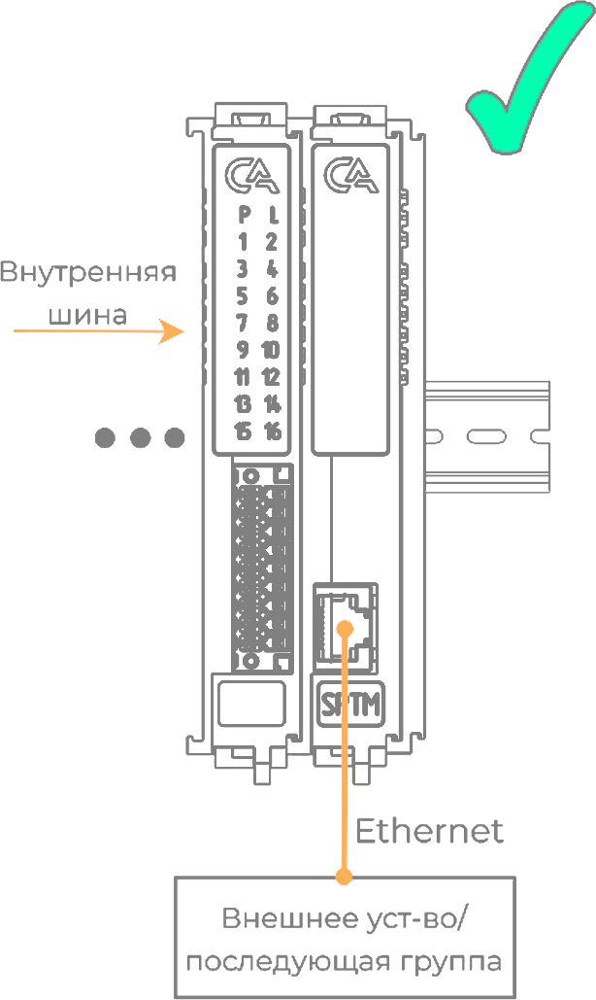

# Модуль оконечный IPCSA-OG-SPТM

## Общие сведения

??? example "Тестирование"

    На текущий момент модуль на стадии тестирования. Серийный выпуск запланирован на декабрь 2025 года 

{ width="150" align=left  }
Модуль оконечный (SPTM) (арт. IPCSA-OG-SPTM) является модулем расширения и предназначен для перехода с внутренней шины на внешнюю шину Ethernet через порт RJ-45.
Модуль используется для подключения последующих групп модулей и ставится как в конце, так и в начале каждой группы.

## Технические характеристики 

| Характеристика                             | Значение          |
|--------------------------------------------|-------------------|
| Количество портов RJ-45                    | 1                 |
| Индикация                                  | Отсутствует       |
| Тип подключаемой шины                      | Ethernet 100 Мбит |
| Максимальная длина подключаемого кабеля, м | 100               |
| Масса, г                                   | 120               |
| Габариты ВхШхГ, мм                         | 126х21х90         |

## Эксплуатационные характеристики
| Характеристика                   | Значение           |
| -------------------------------- | -                  |
| Температура эксплуатации, °С     | От минус 40 до 60  |
| Температура хранения, °С         | От минус 40 до 60  |
| Влажность при хранении, %	       | От 5 до 95         |
| Влажность при эксплуатации, %    | От 5 до 95         |
| Тип монтажа                      | На DIN-рейку 35 мм |
| Расположение при монтаже         | Вертикальное       |

## Схема подключения

{ width="250"  }
{ width="260" }
{ width="290"  }

???+ danger "Использовать только первым или полседним в группе"

    Использовать в качестве модуля запрещено! Воспользуйтесь [модулем расширения коммутации](SPSE.md)

| Обозначение | Наименование канала | Описание                    |
|-------------|---------------------|-----------------------------|
| 1           | -                   | Не используется             |
| 2           | -                   | Не используется             |
| 3           | -                   | Не используется             |
| 4           | -                   | Не используется             |
| 5           | -                   | Не используется             |
| 6           | -                   | Не используется             |
| 7           | +24В_1              | Плюс 1-го источника питания |
| 8           | +24В_2              | Плюс 2-го источника питания |
| 9           | +24В_1              | Плюс 1-го источника питания |
| 10          | +24В_2              | Плюс 2-го источника питания |
| 11          | GND                 | Общий контакт               |
| 12          | GND                 | Общий контакт               |
| 13          | GND                 | Общий контакт               |
| 14          | GND                 | Общий контакт               |
| 15          | FG                  | Защитное заземление         |
| 16          | FG                  | Защитное заземление         |
| 17          | FG                  | Защитное заземление         |
| 18          | FG                  | Защитное заземление         |

???+ warning "Предупреждение"

    Без подключения защитного заземления не использовать

## Размеры

=== "Габаритные размеры" 
    
=== "Установочные размеры"
     

