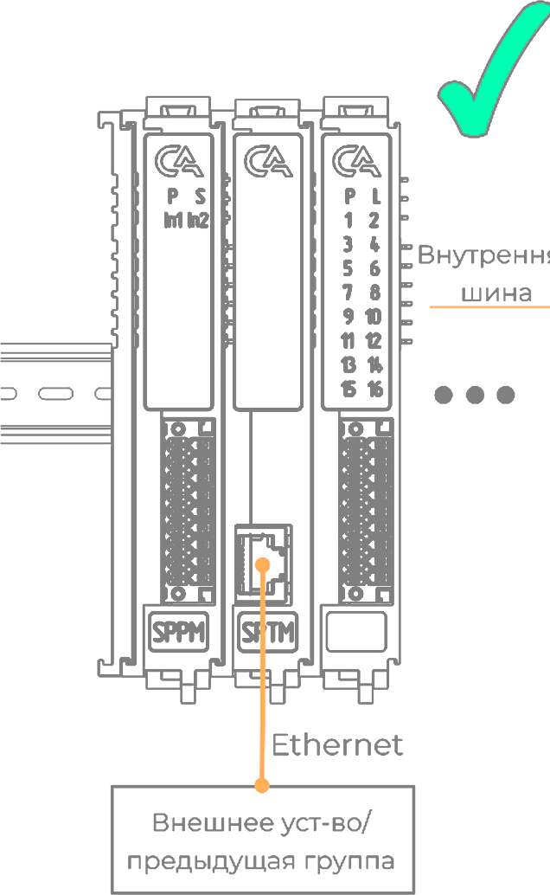
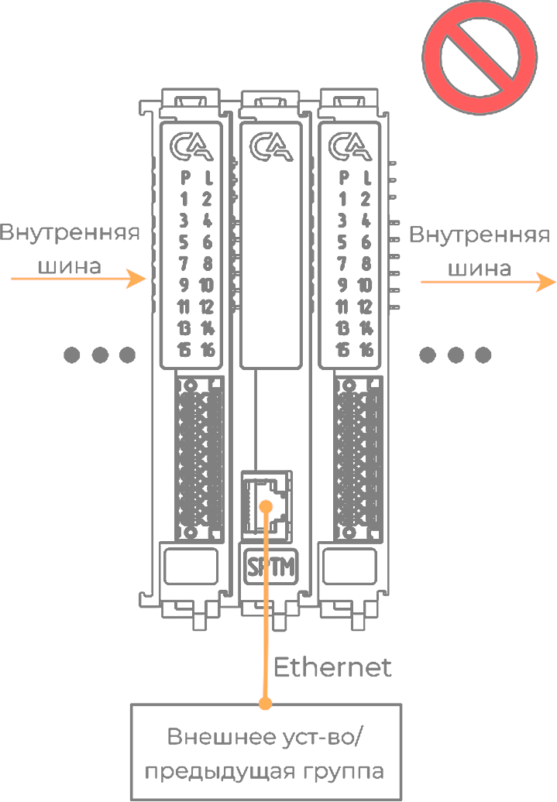

# Модуль оконечный PP-P5-SPТM

## Общие сведения

??? example "Тестирование"
    На текущий момент модуль на стадии тестирования. Серийный выпуск запланирован на декабрь 2025 года 

{ width="150" align=left  }
Модуль оконечный (SPTM) (арт. PP-P5-SPTM) является модулем расширения и предназначен для перехода с внутренней шины на внешнюю шину Ethernet через порт RJ-45.
Модуль используется для подключения последующих групп модулей и ставится как в конце, так и в начале каждой группы.

## Технические характеристики 
| Характеристика                             | Значение          |
|--------------------------------------------|-------------------|
| Количество портов RJ-45                    | 1                 |
| Индикация                                  | Отсутствует       |
| Тип подключаемой шины                      | Ethernet 100 Мбит |
| Максимальная длина подключаемого кабеля, м | 100               |
| Масса, г                                   | 120               |
| Габариты ВхШхГ, мм                         | 126х21х90         |

## Эксплуатационные характеристики
| Характеристика                   | Значение           |
| -------------------------------- | -                  |
| Температура эксплуатации, °С     | От минус 40 до 60  |
| Температура хранения, °С         | От минус 40 до 60  |
| Влажность при хранении, %	       | От 5 до 95         |
| Влажность при эксплуатации, %    | От 5 до 95         |
| Тип монтажа                      | На DIN-рейку 35 мм |
| Расположение при монтаже         | Вертикальное       |

## Схема подключения
{ width="250"  }
{ width="260" }
{ width="290"  }

???+ danger "Использовать только первым или полседним в группе"
    Использовать в качестве модуля расширения запрещено! Воспользуйтесь [модулем расширения коммутации](SPSE.md)

## Размеры
=== "Габаритные размеры" 
    { width="580"}
=== "Установочные размеры"
     

<model-viewer src="https://manual.saplc.ru//img/3d/SPTM.glb"
alt="3D Model"
auto-rotate
camera-controls
poster="https://manual.saplc.ru//img/3d/posterSPTM.webp"
camera-orbit="160deg 75deg 348m"
field-of-view="30deg"
exposure="0.5"
style="width: 100%; height: 500px;">
</model-viewer>

## Файлы для скачивания   
<a href="/downloads/Module RJ45.STEP" download>3D-модель</a>   
<a href="/downloads/Module RJ45.dwg" download>2D-модель</a>    