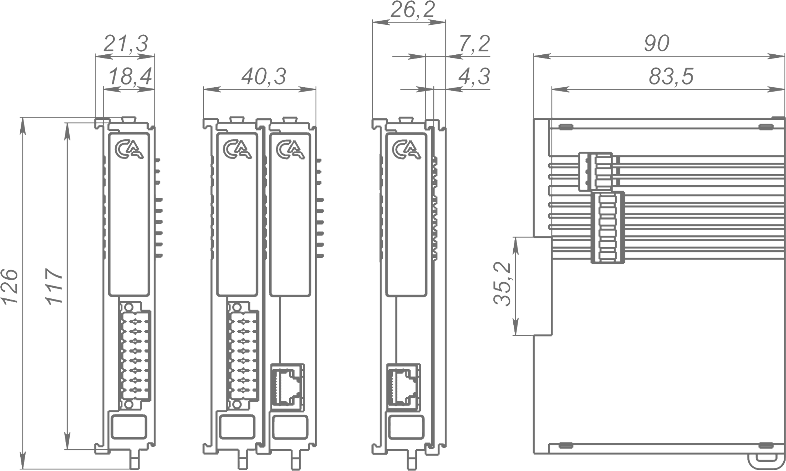

# Модуль управления драйвером шагового двигателя IPCSA-OG-SSMD

## Общие сведения

??? abstract "Формирование задания"

    На текущий момент модуль на стадии формирования технического задания. Начало разработки запланировано на февраль 2025 года 

{ width="150" align=left  }
Модуль управления шаговым двигателем (арт. IPCSA-OG-SSMD) является 4-х канальным модулем расширения и предназначен подключения драйверов шаговых двигателей.
Логические уровни по напряжению равны напряжению внешнего источника питания.

## Технические характеристики 

| Характеристика                                           | Значение                                                       |
|----------------------------------------------------------|---------------------------------------------------------------|
| Количество выходных каналов                              | 4                                                             |
| Выходное напряжение контактов pul, dir, ena              | от 2 до 30 В (равняется напряжению поданному на контакты V+ и GND) |
| Максимальная частота контакта pul не менее               | 200 кГц                                                       |
| Гальваническая изоляция                                  | Между входной и выходной логикой                              |
| Тип проводника                         | Медный                       |
| Сечение проводника, мм²                | От 0,2 до 1,5                |
| Масса, г                               | 125                          |
| Габариты ВхШхГ, мм                     | 126х21,3х90                  |

## Эксплуатационные характеристики
| Характеристика                   | Значение           |
| -------------------------------- | -                  |
| Температура эксплуатации, °С     | От минус 40 до 60  |
| Температура хранения, °С         | От минус 40 до 60  |
| Влажность при хранении, %	       | От 5 до 95         |
| Влажность при эксплуатации, %    | От 5 до 95         |
| Тип монтажа                      | На DIN-рейку 35 мм |
| Расположение при монтаже         | Вертикальное       |

## Схема подключения

{ width="370"; align=left  }

{ width="170";  }

| Обозначение | Название канала  | Описание                              |
|-------------|------------------|---------------------------------------|
| 1           | PUL1             | Импульсный сигнал канала 1            |
| 2           | DIR1             | Сигнал направления канала 1           |
| 3           | ENA1             | Сигнал разрешения работы канала 1     |
| 4           | ALM1             | Индикатор неисправности канала 1      |
| 5           | PUL2             | Импульсный сигнал канала 2            |
| 6           | DIR2             | Сигнал направления канала 2           |
| 7           | ENA2             | Сигнал разрешения работы канала 2     |
| 8           | ALM2             | Индикатор неисправности канала 2      |
| 9           | PUL3             | Импульсный сигнал канала 3            |
| 10          | DIR3             | Сигнал направления канала 3           |
| 11          | ENA3             | Сигнал разрешения работы канала 3     |
| 12          | ALM3             | Индикатор неисправности канала 3      |
| 13          | PUL4             | Импульсный сигнал канала 4            |
| 14          | DIR4             | Сигнал направления канала 4           |
| 15          | ENA4             | Сигнал разрешения работы канала 4     |
| 16          | ALM4             | Индикатор неисправности канала 4      |
| 17          | V+               | "+" внешнего питания                  |
| 18          | GND              | "-" внешнего питания                  |

## Индикация
{ width="50" }

| Обозначение | Индикация | Показатель |
|------------------|----------------------|---------------------------------------|
| P | :green_circle:| Наличие напряжения питания |
| P | :white_circle:| Отсутствие напряжения питания |
| L | :green_circle:| Наличие соединения Ethernet |
| L | :yellow_circle: :green_circle: :yellow_circle: | Обмен данными по Ethernet |
| L | :white_circle:| Отсутствие соединения Ethernet|
| 1 - 4 | :green_circle:| ENA 1 - 4 активен (программная реализация)  |
| 1 - 4 | :red_circle:| Индикация неисправности канала 1 - 4 (программная реализация)|
| 1 - 4 | :white_circle:| ENA 1 - 4 не активен|

## Габаритные размеры

## Программное обеспечение

### Адреса регистов
|Описание|Тип|Индекс|Адрес|Тип данных|Примечание|
|-|-|-|-|-|-|
|Повернуть на, шагов 1 канала|RxPDO |?|?|SIGNED32|Положительное значение поворот по часовой, отрицательное – против часовой| 
|Повернуть на, градусов 1 канала|RxPDO |?|?|REAL32|Положительное значение поворот по часовой, от-рицательное – против ча-совой|
|Непрерывно поворачивать 1 канала|RxPDO |?|?|SIGNED8|+1 поворот по часовой стрелке, -1 поворот про-тив часовой стрелки|
|Повернуть на, шагов 2 канала|RxPDO |?|?|SIGNED32|Положительное значение поворот по часовой, отрицательное – против часовой| 
|Повернуть на, градусов 2 канала|RxPDO |?|?|REAL32|Положительное значение поворот по часовой, от-рицательное – против ча-совой|
|Непрерывно поворачивать 2 канала|RxPDO |?|?|SIGNED8|+1 поворот по часовой стрелке, -1 поворот про-тив часовой стрелки|
|Повернуть на, шагов 3 канала|RxPDO |?|?|SIGNED32|Положительное значение поворот по часовой, отрицательное – против часовой| 
|Повернуть на, градусов 3 канала|RxPDO |?|?|REAL32|Положительное значение поворот по часовой, от-рицательное – против ча-совой|
|Непрерывно поворачивать 3 канала|RxPDO |?|?|SIGNED8|+1 поворот по часовой стрелке, -1 поворот про-тив часовой стрелки|
|Повернуть на, шагов 4 канала|RxPDO |?|?|SIGNED32|Положительное значение поворот по часовой, отрицательное – против часовой| 
|Повернуть на, градусов 4 канала|RxPDO |?|?|REAL32|Положительное значение поворот по часовой, от-рицательное – против ча-совой|
|Непрерывно поворачивать 4 канала|RxPDO |?|?|SIGNED8|+1 поворот по часовой стрелке, -1 поворот про-тив часовой стрелки|
|Ошибка 1 канала|TxPDO |?|?|BOOL|1 – ошибка, 0 – нет ошибки|
|Ошибка 2 канала|TxPDO |?|?|BOOL|1 – ошибка, 0 – нет ошибки|
|Ошибка 3 канала|TxPDO |?|?|BOOL|1 – ошибка, 0 – нет ошибки|
|Ошибка 4 канала|TxPDO |?|?|BOOL|1 – ошибка, 0 – нет ошибки|
|Настройка микрошага, PU/Rev 1 канала|SDO|-|?|UINT32||
|Скорость поворота, градусов/минуту 1 канала|SDO|-|?|REAL32||
|Настройка микрошага, PU/Rev 2 канала|SDO|-|?|UINT32||
|Скорость поворота, градусов/минуту 2 канала|SDO|-|?|REAL32||
|Настройка микрошага, PU/Rev 3 канала|SDO|-|?|UINT32||
|Скорость поворота, градусов/минуту 3 канала|SDO|-|?|REAL32||
|Настройка микрошага, PU/Rev 4 канала|SDO|-|?|UINT32||
|Скорость поворота, градусов/минуту 4 канала|SDO|-|?|REAL32||