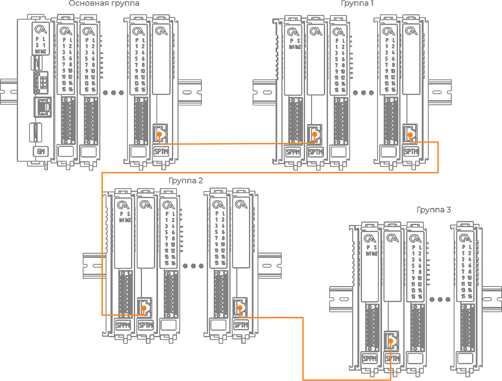
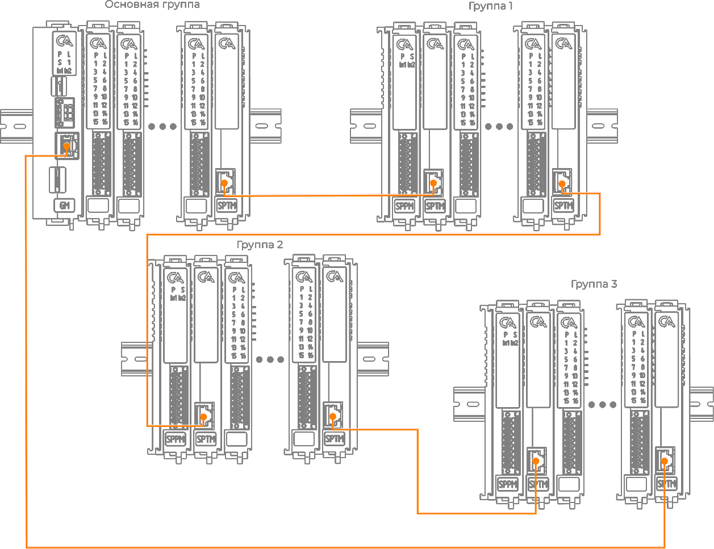
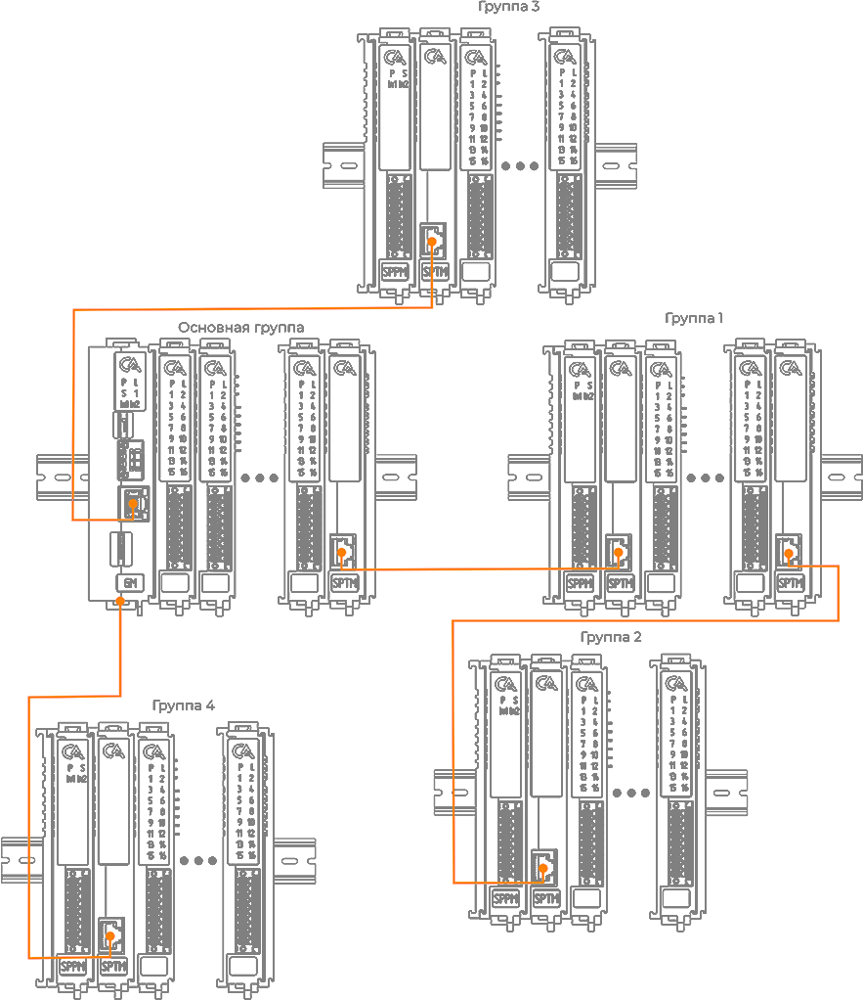
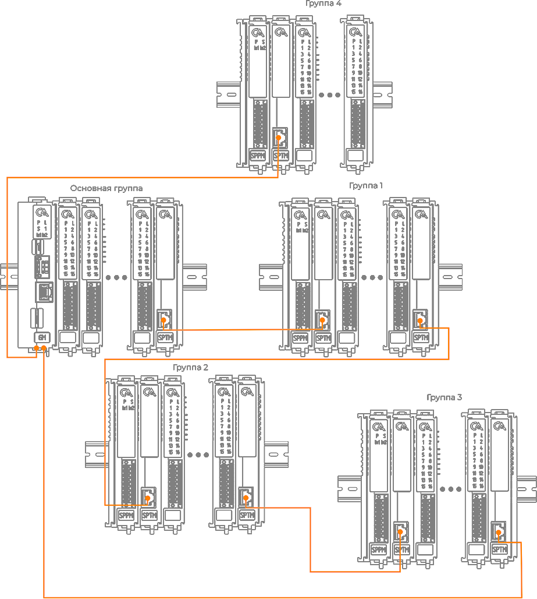

# Составление сборки
## Сборка «Шина»
Сборка «Шина» составляется из основной и дополнительных групп. Первой группой является основная, последующие дополнительные группы связываются при помощи кабеля Ethernet c патч кордами RJ-45 через Модули оконечные (SPTM).
???+ info "Заметка"
    Максимальная длина кабеля Ethernet между группами – 100 метров.

## Сборка «Кольцо»
Сборка «Кольцо» представляет собой сборку групп, кабель Ethernet, которой выходит и заходит в основную группу.
Преимуществом данного вида сборки является «горячая» замена модулей расширения. «Горячая» замена позволяет демонтировать модули расширения ввода/вывода аналоговых и дискретных команд и монтировать их обратно.
???+ info "Заметка"
    Максимальная длина кабеля Ethernet между группами – 100 метров.

## Сборка «Древовидная»
Сборка «Древовидная» позволяет связать несколько дополнительных (выносных) групп на общей группе, например, когда все дополнительные группы находятся на большом удалении от основной группы.
???+ info "Заметка"
    Максимальная длина кабеля Ethernet между группами – 100 метров.
  

## Сборка «Смешанная»
«Смешанная» сборка позволяет совместить вышеуказанные типы сборок. Имеется возможность соединить большую часть групп в «Кольцо», при этом дополнительные группы, находящихся на большом удалении можно подсоединить по типу «Древовидная».
???+ info "Заметка"
    Максимальная длина кабеля Ethernet между группами – 100 метров.
  