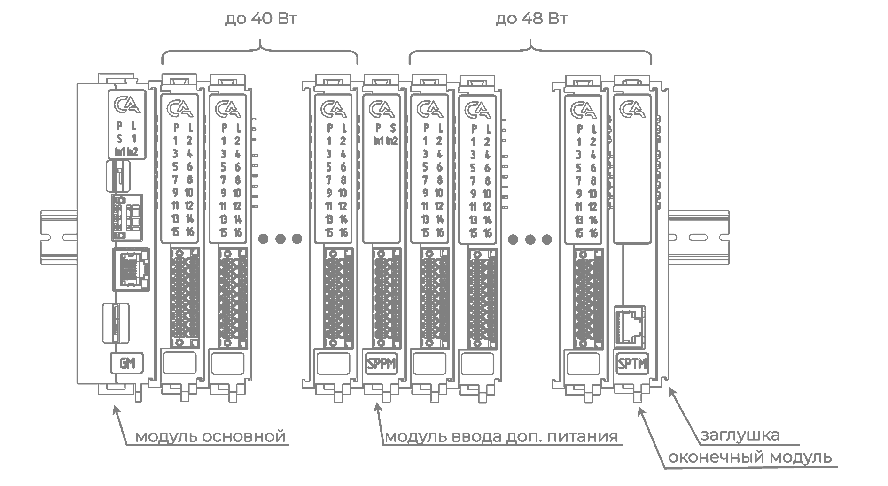
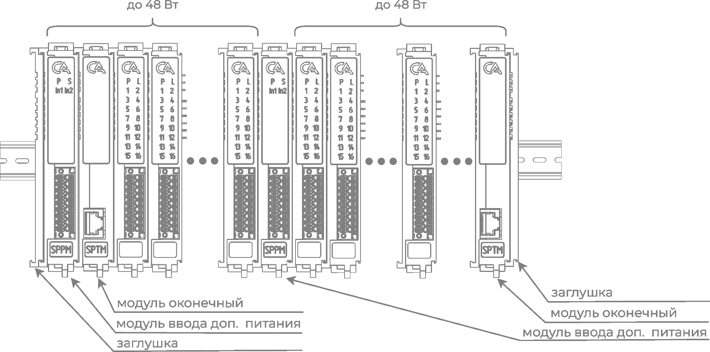

# Составление групп
## Составление основной (базовой) группы
Основная группа является первой собираемой группой в ПЛК и обеспечивает работу дополнительных групп в одном ПЛК.
 
#### При составлении основной группы необходимо придерживаться следующих правил:
1. В начале основной группы обязательно ставится Модуль основной GM;
2. При необходимости расширения ПЛК другими группами в конце основной группы устанавливается Модуль оконечный SPTM;
3. После основного модуля ставятся модули расширения в количестве, рассчитываемом по потребляемой мощности подробнее в главе о [организации питания](power.md)
???+ danger "На последний модуль в группе в обязательном порядке ставится заглушка."

    Отсуствие заглушки может привести к неработоспособности всех модулей!
## Составление дополнительной (выносной) группы 
Дополнительная группа составляется в случае, если функций основной группы в ПЛК недостаточно, например, при необходимости выноса некоторых модулей или размещения ПЛК на нескольких DIN-рейках в одном шкафу.

#### При составлении дополнительной (выносной) группы необходимо придерживаться следующих правил:
1. В начале группы обязательно устанавливается [Модуль ввода дополнительного питания (SPPM)](SPPM.md), который обеспечивает питание последующих модулей мощностью 48 Вт. Расчет количества модулей в соответствии с п.3 для сборки основной группы.
2. Вторым модулем в дополнительной группе обязательно ставится [Модуль оконечный (SPTM)](SPTM.md), который обеспечивает связь с предыдущими группами.
3. При необходимости [Модули ввода дополнительного питания (SPPM)](SPTM.md) ставятся в соответствии с п.3 правил составления основной группы.
4. При необходимости расширения ПЛК последующими дополнительными группами или подключения по схеме «Кольцо» в конце дополнительной группы ставится [Модуль оконечный (SPTM)](SPTM.md).
5. На первый и последний модуль в группе в обязательном порядке ставится заглушка. 