# Монтаж и демонтаж
## Монтаж и демонтаж модулей
### Общие правила
При монтаже для контроллера предварительно подготавливается место в шкафу электрооборудования. Конструкция шкафа должна обеспечивать защиту контроллера от попадания в него влаги, грязи и посторонних предметов.
Монтаж модулей	 осуществляется в вертикальном положении посредством присоединения к стандартной DIN-рейке шириной 35 мм.

### Монтаж первого модуля в группе
#### Последовательность монтажа модуля на DIN-рейку:
1. Приставить первый модуль к DIN-рейке пазом.
2. Зафиксировать модуль на DIN-рейке, установив защелки на модуле сверху и снизу в положение фиксации на DIN-рейке.  
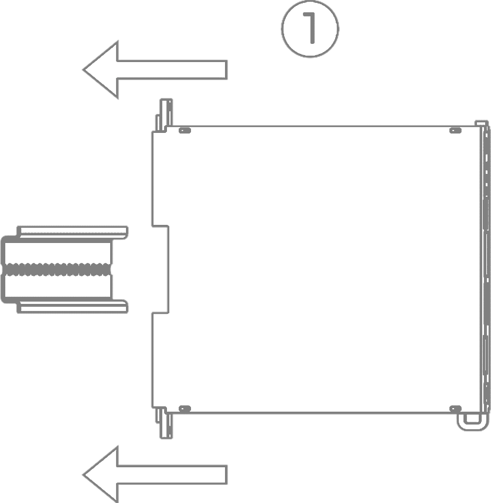{ width="280" }
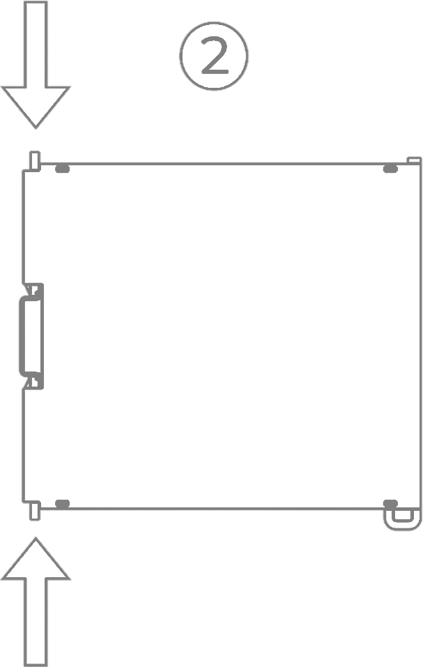{ width="200" }
### Монтаж последующих модулей в группе
#### Последовательность монтажа модуля на DIN-рейку:
1. Присоединить модуль к уже установленному методом шип-паз.
2. Задвинуть устанавливаемый модуль вдоль шип-паза до упора к DIN-рейке.
3. Установить защелки сверху и снизу в положение фиксации на DIN-рейке.  
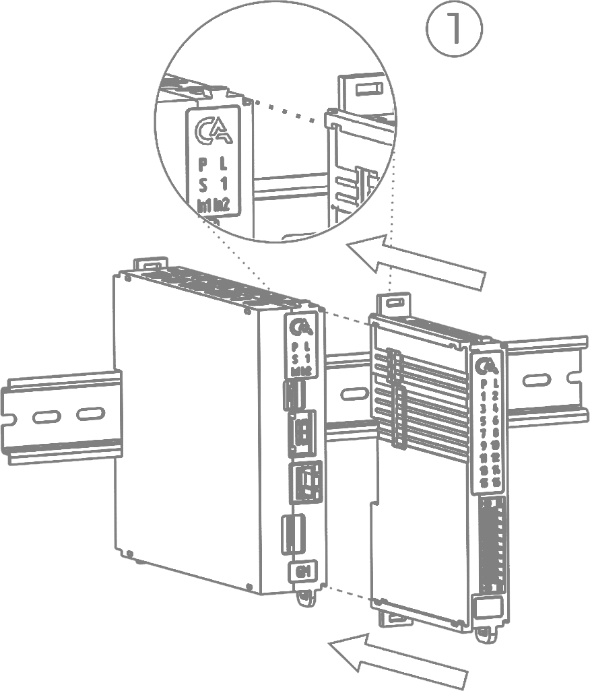{ width="300" }
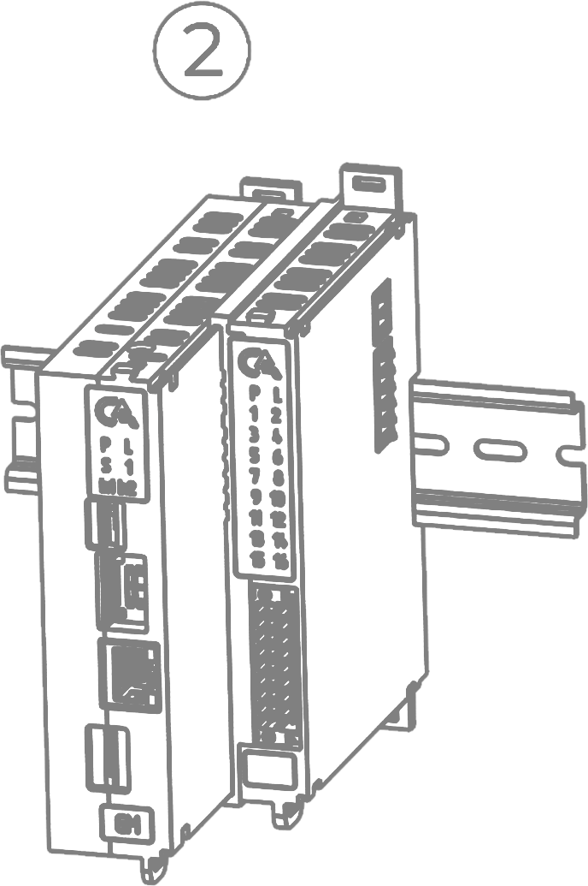{ width="200" }
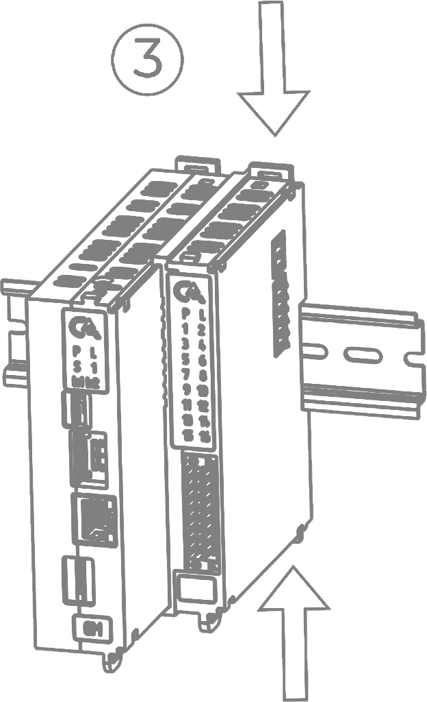{ width="200" }
### Демонтаж модулей
#### Последовательность демонтажа модуля:
1. Убедиться, что подводящие кабели к модулю отсоединены.
2. Плоской отверткой перевести защелки снизу и сверху модуля в открытое положение.
3. Потянуть модуль на себя вдоль линии шип-пазов до полного отсоединения.  
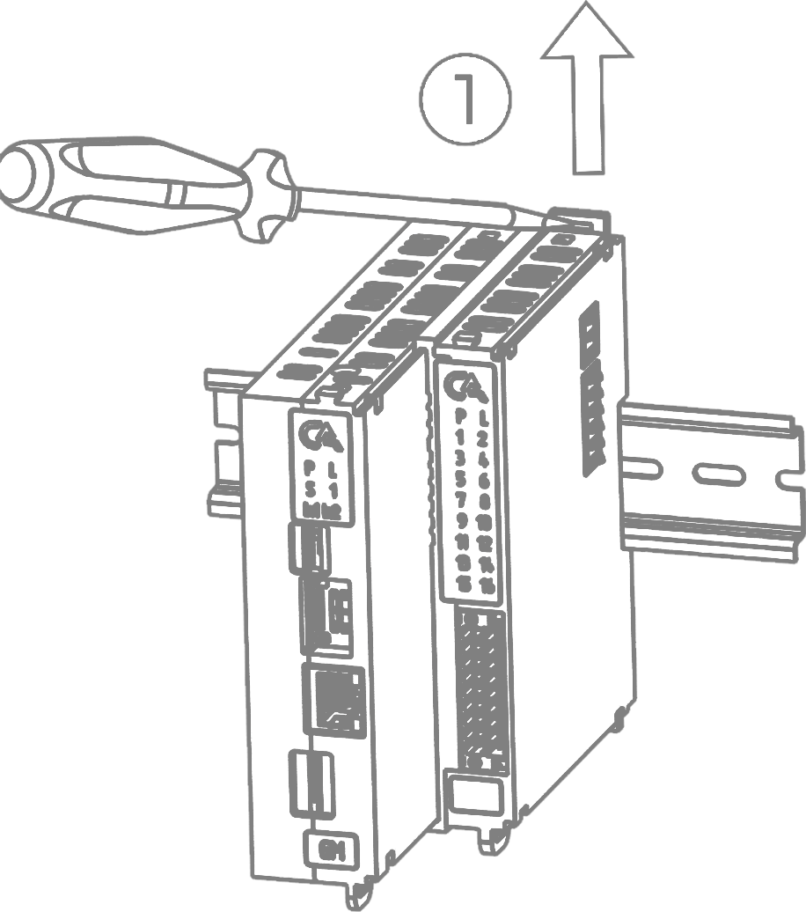{ width="250" }
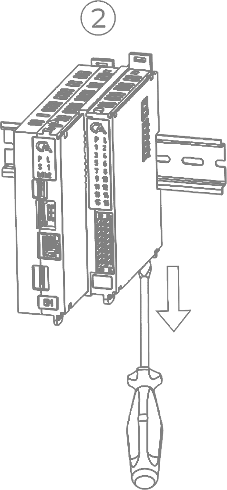{ width="200" }
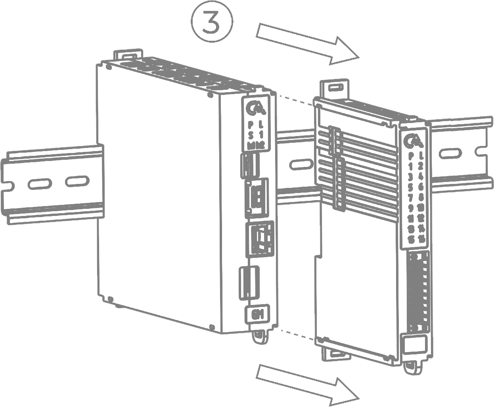{ width="250" }
## Монтаж и демонтаж подводящих кабелей
### Общие требования к монтажу кабелей
* Для обеспечения надежности электрических соединений рекомендуется использовать только медные провода. Провод перед соединением необходимо зачистить на длину 12 мм, с таким расчетом, чтобы срез изоляции плотно прилегал к клеммной колодке, т.е. чтобы оголенные участки провода не выступали за ее пределы.
* Для гибкого (многожильного) провода следует использовать наконечники штыревые втулочные изолированные типа НШВИ соответствующего кабелю сечения. Допускается монтаж многожильного провода без использования НШВИ предварительно скрутив жилы провода.
* Максимальное сечение проводов, подключаемых к клеммной колодке при монтаже жестким или гибким проводом – 1,5 мм2.
* Винты клеммной колодки следует затягивать с усилием 0,2 Нм.

### Подключение подводящих кабелей к клеммной колодке  
1. При подключении одножильного провода или многожильного провода с НШВИ подключить провод к клеммной колодке путем надавливания до упора.  
При подключении многожильного провода без НШВИ надавить на защелку, находящуюся на клеммной колодке напротив нужного разъема, отверткой и одновременно подключить провод к клеммной колодке путем ввода до упора, после чего отвертку отпустить.
2. Подключить все необходимые подводящие кабели согласно схемам подключения на каждый модуль;
3. Вставить клеммную колодку в специальный разъем на модуле;
4. Затянуть винты клеммной колодки;
5. Для удобства следует зафиксировать провода вместе относительно модуля путем закрепления хомута через ушко корпуса модуля.

???+ warning "Предупреждение"

    Перед началом работ по подключению необходимо убедиться в том, что кабели обесточены 

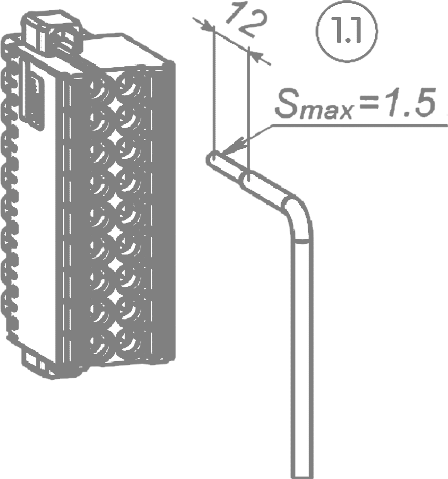{ width="150" }
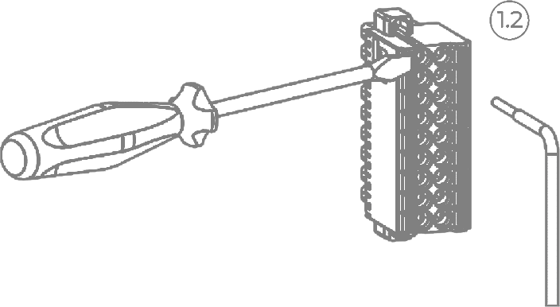{ width="300" }
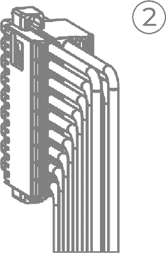{ width="100" }
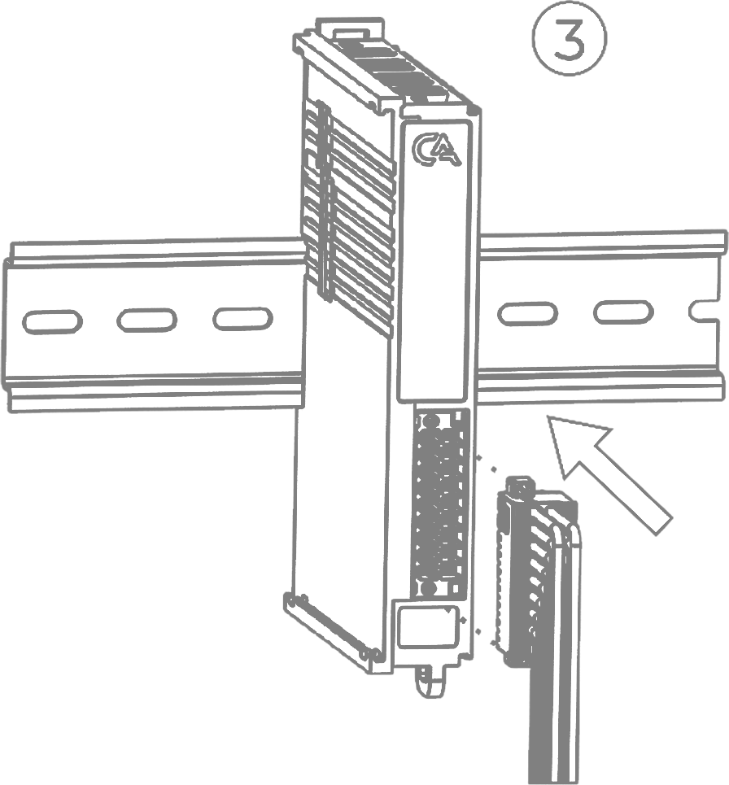{ width="190" }
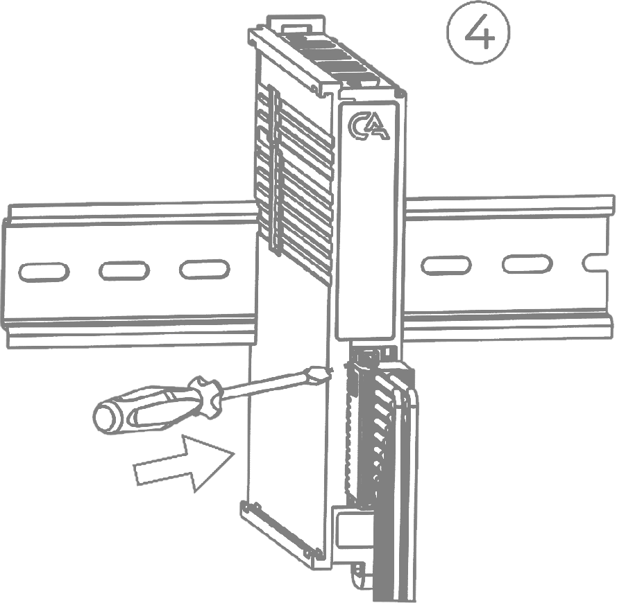{ width="190" }

## Демонтаж подводящих кабелей 
1. Убедиться, что демонтируемые кабели обесточены.
2. Открутить винты на клеммной колодке.
3. Отсоединить клеммную колодку от модуля потянув на себя.
4. Надавить отверткой на защелку оранжевого цвета, расположенной на клеммной колодке напротив демонтируемого кабеля, и одновременно потянуть демонтируемый кабель на себя.  
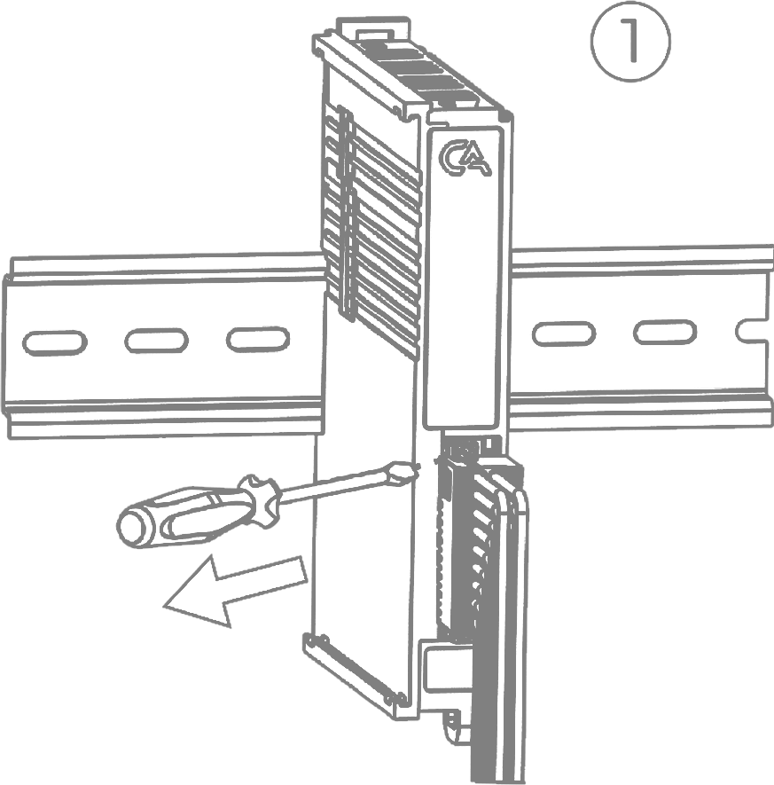{ width="200" }
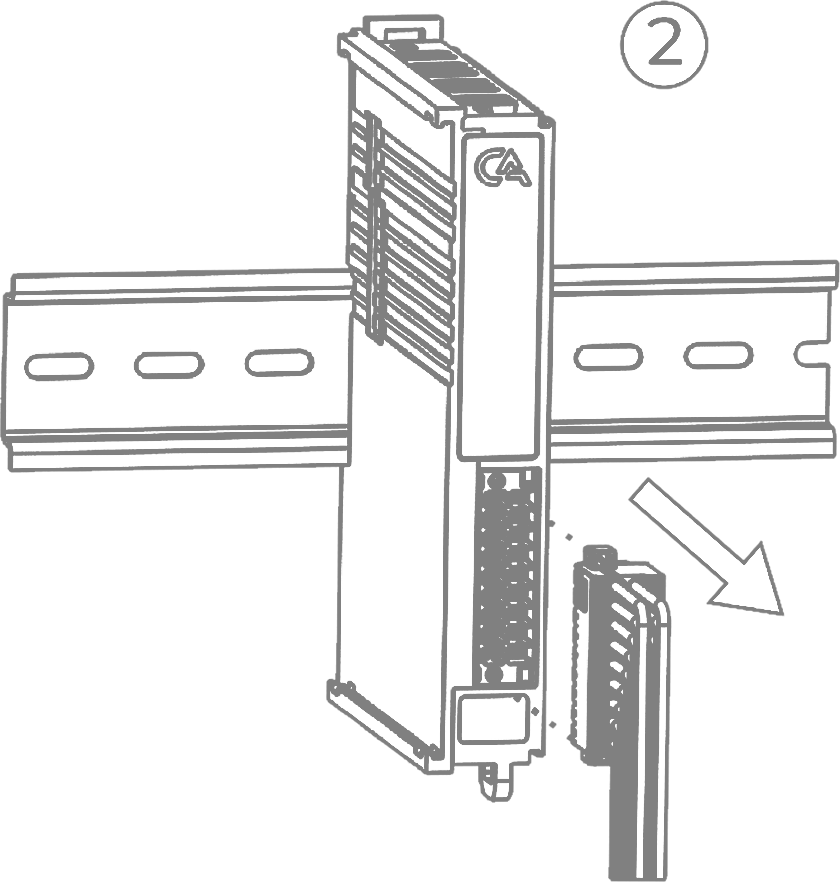{ width="200" }
