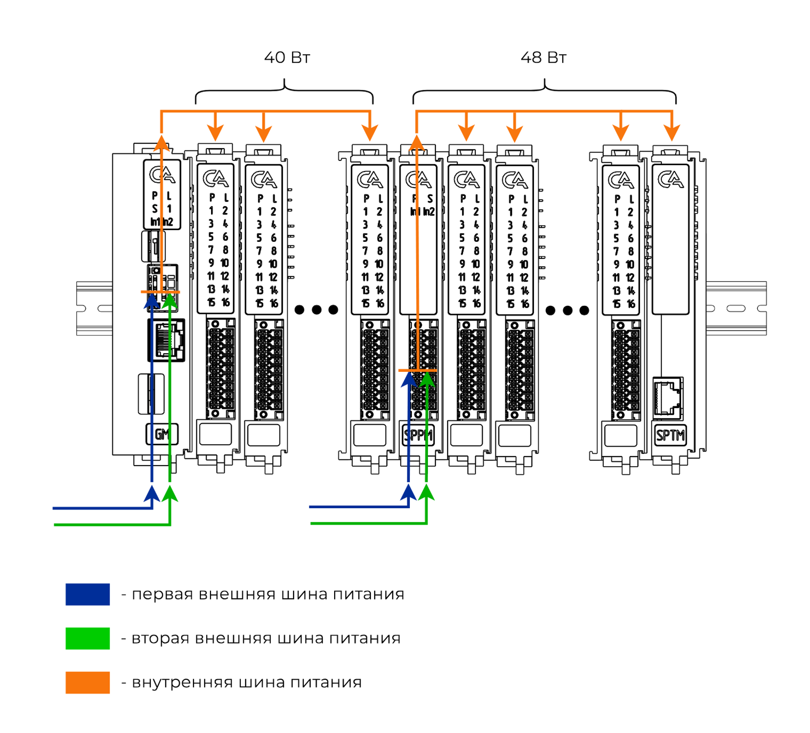

# Организация питания
## Резервирование внешнего питания
Питание контроллера может осуществляется от двух независимых источников питания на каждый модуль, принимающий питание.
Питание в сборку поступает через [Модуль основной (GM)](GM.md) и [Модуль ввода дополнительного питания (SPPM)](SPPM.md)

При подключении 2 источников питания обеспечивается резервирование питания при неисправности одного из двух внешних источников питания
## Расчет потребляемой мощности

После основного модуля необходимо устанавливать [модули расширения питания](SPPM.md) в количестве, рассчитываемом по потребляемой мощности каждого модуля из расчета, что потребляемая мощность всех модулей после [главного](GM.md) не должна превышать 40 Вт, а мощность после [модуля расширения питания](SPPM.md) не должна привышать 48  Вт. Потребляемая мощность каждого модуля приведена ниже

| Наименование модуля |	Максимальная потребляемая мощность, Вт |
|---------------------|----------------------------------------|
| [GM](GM.md)	      | 7,5                                    |
| [DI](DI.md)         | 5                                      |
| [DO](DO.md)	      | 3                                      |
| [DPWM](DPWM.md)     |                                        |
| [AIC](AIC.md)       | 4                                      |
| [AIV](AIV.md)	      | 2,5                                    |
| [AITC](AITC.md)	  | 5,5                                    |
| [AITR](AITR.md)     | 3                                      |
| [AISCT](AISCT.md)   |                                        |
| [AIVS](AIVS.md)     |                                        |
| [AO](AO.md)	      | 7,5                                    |
| [IF485/422](IF485_422.md) | 2,5                              |
| [IF232](IF232.md)   |                                        |
| [IFHART](IFHART.md) |                                        |
| [IFCAN](IFCAN.md)   |                                        |
| [IFARINC](IFARINC.md)|                                       |
| [SPPC](SPPC.md)	  | 7                                      |
| [SPPM](SPPM.md)	  | 0,5                                    |
| [SPSE](SPSE.md)     |                                        |
| [SSMD](SSMD.md)     |                                        |

Пример: после основного модуля необходимо поставить в группу 2 модуля DI, 5 модулей DO и 2 модуля AITC. 
В соответствии с таблицей 1, 
2*P(DI)+5*Р(DO)+2*Р(AITC) = 2*5+ 5*3+2*5,5 = 36,
что меньше 40, а следовательно правила питания не нарушаются.
